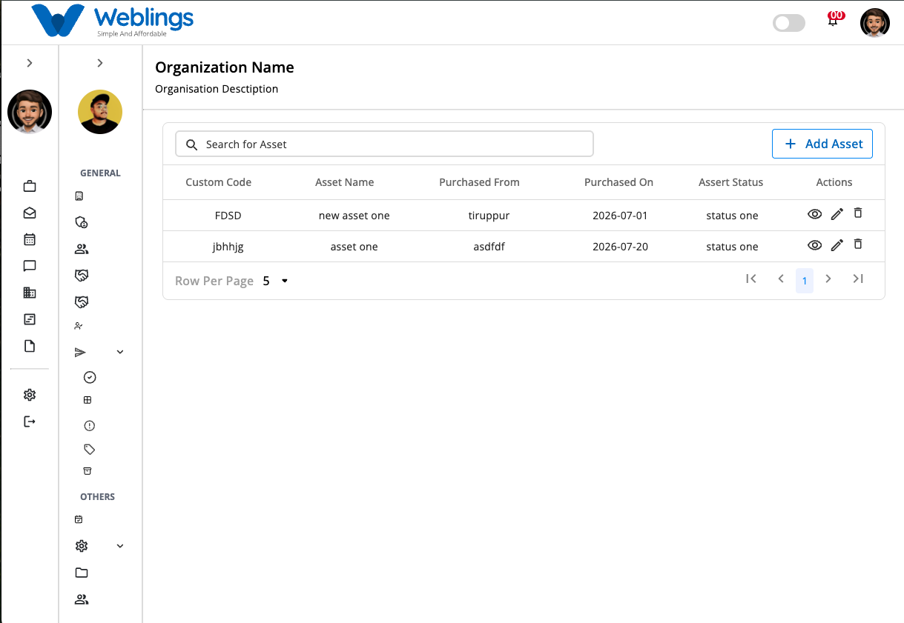
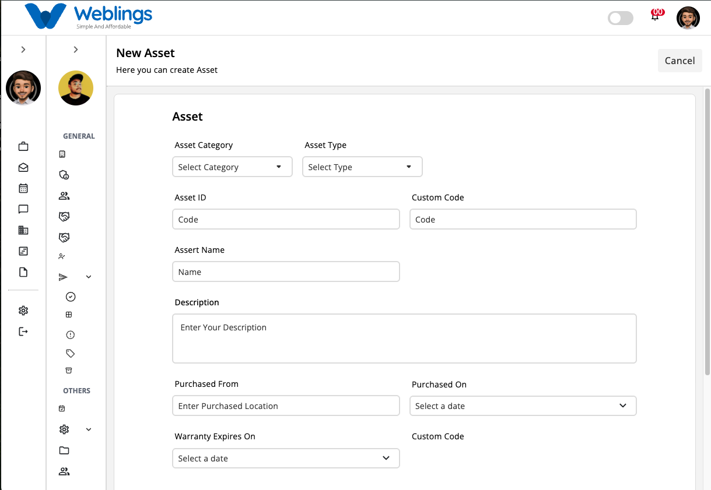
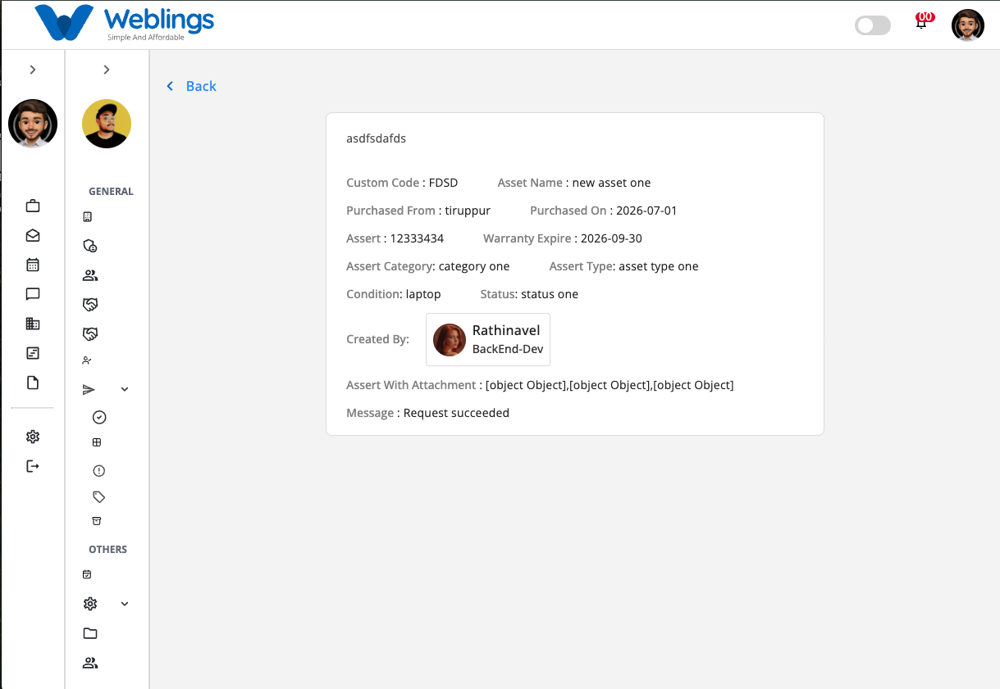
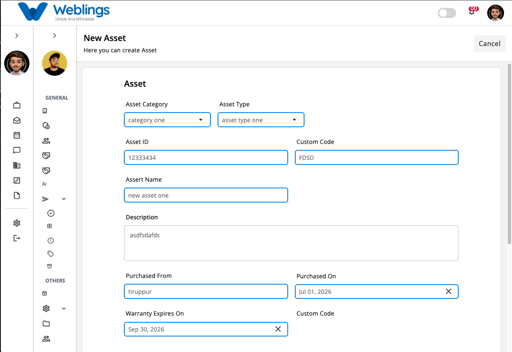
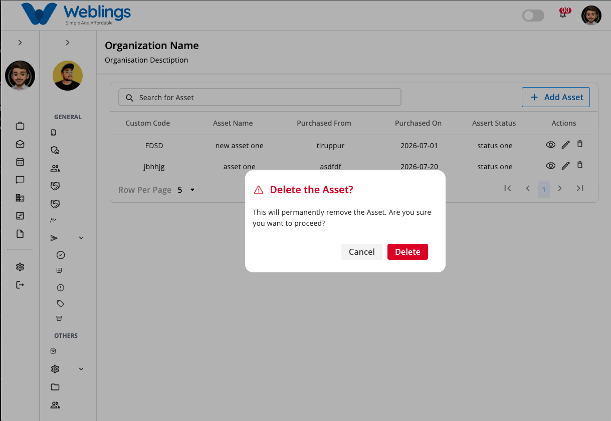

# Asset

The **Asset** screen allows you to create and manage all organizational assets from a single location. Each asset can be assigned a category, type, condition, status, purchase information, warranty details, and supporting attachments.

From this screen, you can:

- View all assets.
- Search for an asset.
- Create a new asset.
- View asset details.
- Edit asset information.
- Delete an asset.

---

# Asset List

The Asset table displays all assets created for your organization.

The table contains the following information:

- **Custom Code** – A unique identifier for the asset.
- **Asset Name** – The name of the asset.
- **Purchased From** – The supplier or vendor from whom the asset was purchased.
- **Purchased On** – The purchase date.
- **Actions** – View, Edit, and Delete options.

Use the **Search Asset** box to quickly locate an asset by entering its **Asset Name**, **Asset ID**, or **Custom Code**.

---

# Create a New Asset

To create a new asset, click **Add Asset**.

The **New Asset** page will open.

## Asset Information

Complete the following information.

### Asset Category

Select the category that best matches the asset.

### Asset Type

Select the asset type.

### Asset ID

Enter or verify the unique Asset ID.

### Custom Code

Enter a unique custom code for the asset.

### Asset Name

Enter a meaningful name for the asset.

**Examples:**

- Dell Latitude 5440
- HP LaserJet Pro MFP
- Toyota Innova
- Lenovo ThinkCentre

### Description

Provide a short description of the asset.

### Purchased From

Enter the supplier or vendor name.

**Example:**

- Dell Technologies
- HP Store
- ABC Office Supplies

### Purchased On

Select the purchase date.

### Warranty Expires On

Select the warranty expiration date.

### Asset Condition

Select the current condition of the asset.

Examples:

- New
- Good
- Fair
- Damaged
- Under Maintenance

### Asset Status

Select the current asset status.

Examples:

- Available
- Assigned
- In Use
- Under Maintenance
- Retired

### Asset Image

Upload an image of the asset.

Supported image formats may include:

- JPG
- JPEG
- PNG

Uploading an image helps identify the asset more easily.

---

## Submit

Click **Submit** to create the asset.

The asset will be added to the Asset list.

---

## Cancel

Click **Cancel** to return to the previous screen without saving.

---

# View Asset

To view an asset:

1. Click the **View** (👁️) icon from the **Actions** column.

The Asset Details page displays:

- Asset ID
- Custom Code
- Asset Name
- Purchased From
- Purchased On
- Warranty Expires On
- Asset Category
- Asset Type
- Asset Condition
- Asset Status
- Created By
- Asset Image / Attachment
- Message

This page is for viewing information only.

---

# Edit an Asset

To modify an existing asset:

1. Click the **Edit** (✏️) icon.
2. Update any of the following information:
    - Asset Category
    - Asset Type
    - Asset ID
    - Custom Code
    - Asset Name
    - Description
    - Purchased From
    - Purchased On
    - Warranty Expires On
    - Asset Condition
    - Asset Status
    - Previously Added Asset Image
    - Upload New Asset Image
3. Click **Update** to save your changes.

The updated information will immediately appear in the Asset list.

If you do not wish to save your changes, click **Cancel**.

---

# Delete an Asset

To remove an asset:

1. Click the **Delete** (🗑️) icon.
2. A confirmation dialog will appear.

## Confirmation Message

> **This will permanently remove the Asset. Are you sure you want to proceed?**
> 

You will have two options:

### Cancel

Returns to the previous screen without deleting the asset.

### Delete

Permanently removes the selected asset.

> **Note:** Deleting an asset cannot be undone. Before deleting, ensure that the asset is no longer assigned to any employee, department, or business process.
> 

---

[FAQ](E%20Office/Asset/Asset/FAQ%203b47b1088175807ead86daa4e4075425.md)