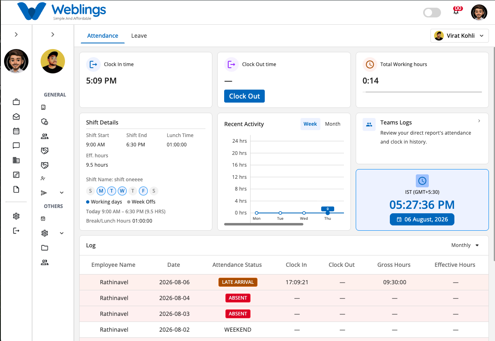
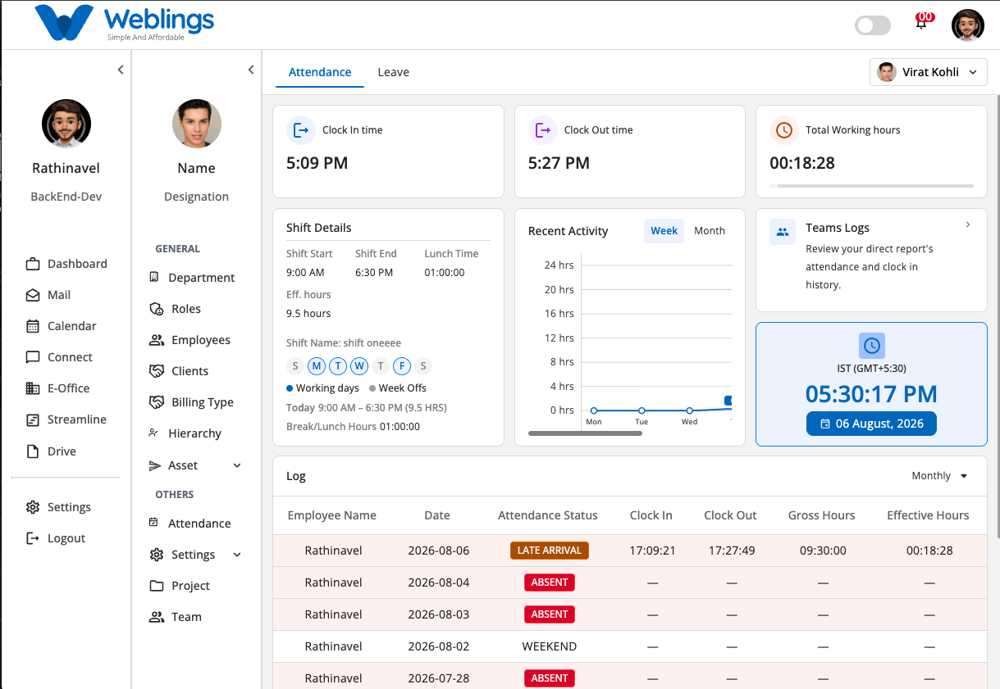
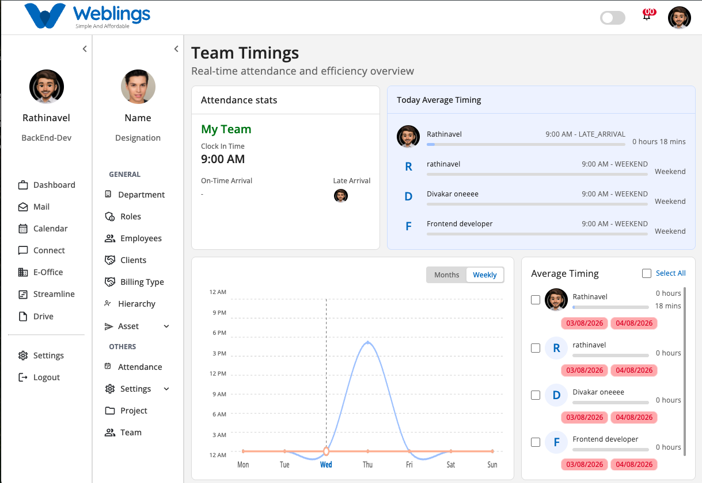

# Attendance



The **Attendance** module helps employees record their daily attendance, monitor their working hours, view shift information, track attendance history, and manage leave requests from a single screen.

The Attendance module contains two tabs:

- Attendance
- Leave

---

# Attendance Dashboard

The **Attendance** dashboard provides a real-time overview of your workday.

From this screen, you can:

- Clock In
- Clock Out
- View Total Working Hours
- View Shift Details
- Monitor Recent Activity
- View Team Attendance Logs
- Check Current Date & Time
- Review Attendance History

---

# Clock In

.png)

Click **Clock In** to begin your workday.

When you click the button, a confirmation window appears.

### Web Clock In

The dialog displays a welcome message along with the current time.

Click **Clock In** to confirm your attendance.

Once completed:

- Clock In Time is recorded.
- Clock Out button becomes available.
- Attendance log is updated.
- Working hours begin calculating automatically.

---

# Clock Out

.png)

When your work is complete, click **Clock Out**.

A confirmation window will appear.

### Web Clock Out

Click **Clock Out** to finish your workday.

Once completed:

- Clock Out Time is recorded.
- Total Working Hours are calculated.
- Attendance log is updated.
- Your workday is marked as completed.

---

# Total Working Hours



The **Total Working Hours** card displays the total time worked for the current day.

The value updates automatically after Clock In and continues until Clock Out.

---

# Shift Details

The **Shift Details** section displays your assigned work schedule.

It includes:

- Shift Start Time
- Shift End Time
- Lunch Break Duration
- Effective Working Hours
- Shift Name
- Working Days
- Weekly Off Days
- Today's Shift Timing

This helps you verify your assigned schedule before starting work.

---

# Recent Activity

The **Recent Activity** chart shows your attendance trend.

You can switch between:

- Week View
- Month View

This graph helps you monitor your attendance consistency over time.

---

# Team Logs



Click the Team Logs card to open the Team Timings page

The **Team Timings** section provides managers with a real-time overview of their team's attendance and working hours. It helps monitor attendance, identify late arrivals, compare working hours, and analyze attendance trends across the team.

From this screen, you can:

- View today's attendance statistics.
- Monitor team members' clock-in status.
- Review average working hours.
- Compare employee attendance timings.
- Analyze attendance trends using Weekly or Monthly views.
- Identify late arrivals, absentees, and employees on leave.

---

# Attendance Statistics

The **Attendance Statistics** card displays an overview of your team's attendance for the current day.

It includes:

- Team Name
- Standard Clock-In Time
- Number of On-Time Arrivals
- Number of Late Arrivals

This provides a quick summary of your team's punctuality.

---

# Today's Average Timing

The **Today's Average Timing** panel displays each employee's attendance status for the current day.

For every employee, you can view:

- Employee Name
- Scheduled Start Time
- Current Attendance Status
- Total Working Duration

Possible attendance statuses include:

- Active
- On Time
- Late Arrival
- Weekend
- Absent
- On Leave

---

# Attendance Trend

The **Attendance Trend** chart helps visualize attendance patterns over time.

You can switch between:

- Weekly View
- Monthly View

Use this chart to monitor attendance consistency and identify trends across your team.

---

# Average Timing

The **Average Timing** panel compares employees' average working hours.

For each employee, it displays:

- Employee Name
- Average Working Hours
- Attendance Duration
- Selected Date(s)

Managers can:

- Select individual employees.
- Compare attendance durations.
- Use **Select All** to compare the entire team.

---

# Team Attendance Insights

The Team Timings screen helps managers quickly identify:

- Employees currently working.
- Employees who arrived on time.
- Employees with late arrivals.
- Employees who are absent.
- Employees on leave or weekend.
- Overall attendance consistency.

These insights help managers monitor productivity and attendance effectively.

---

# Current Time

The clock widget displays:

- Current Time
- Current Date
- Time Zone

This helps ensure attendance is recorded using the correct system time.

---

# Attendance Log

The **Attendance Log** displays your attendance history.

You can filter records using:

- Monthly
- Other available periods

Each record displays:

- Employee Name
- Date
- Attendance Status
- Clock In Time
- Clock Out Time
- Gross Hours
- Effective Hours

Common attendance statuses include:

- Present
- Absent
- Late Arrival
- Weekend
- Holiday

---

# Workflow

```
Open Attendance
        ↓
Clock In
        ↓
Work During Assigned Shift
        ↓
Monitor Working Hours
        ↓
Clock Out
        ↓
Attendance Log Updated
        ↓
Request Leave (Optional)
        ↓
Manager Reviews Leave
        ↓
Leave Approved or Rejected
```

---

# Quick Summary

The **Attendance** module allows you to:

- Record Clock In and Clock Out.
- Monitor daily working hours.
- View shift schedules.
- Track attendance history.
- Review team attendance logs.
- Check leave balances.
- Submit leave requests.
- Track leave approval status.