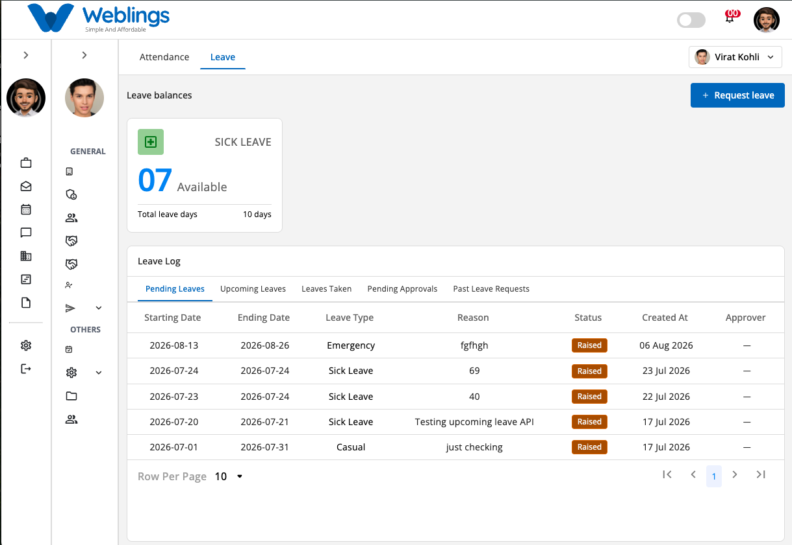
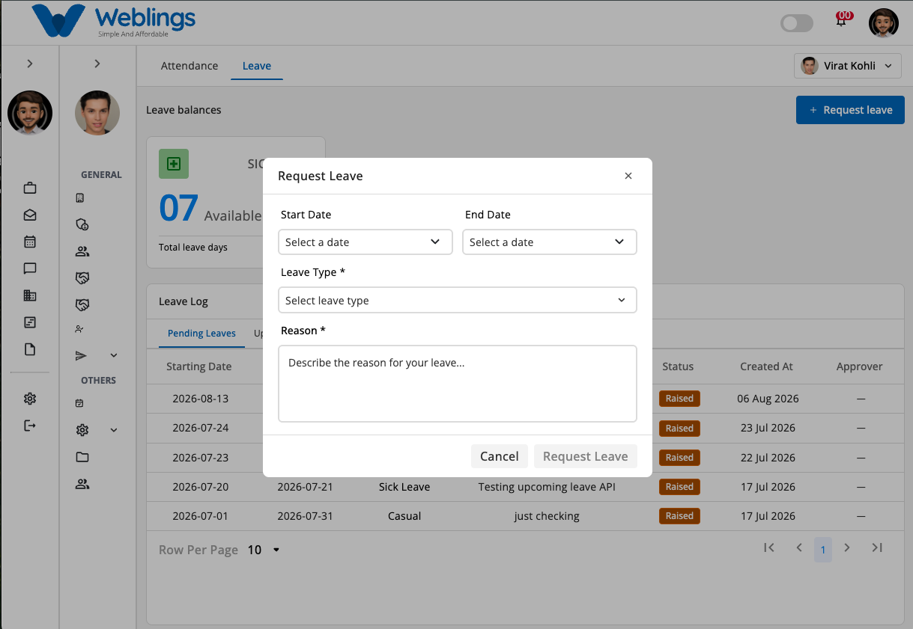

# Leave

Select the **Leave** tab to manage your leave balance and requests.

From this screen you can:

- View Leave Balance
- Request Leave
- Track Leave Requests
- Monitor Leave Approvals

---

# Leave Balance

The Leave Balance card displays:

- Leave Type
- Available Leave Balance
- Total Leave Entitlement

Example:

- Sick Leave
- 7 Available
- Total Leave Days: 10

---

# Leave Log

The Leave Log contains five tabs:

- Pending Leaves
- Upcoming Leaves
- Leaves Taken
- Pending Approvals
- Past Leave Requests

Each record displays:

- Start Date
- End Date
- Leave Type
- Reason
- Status
- Created Date
- Approver

---

# Request Leave

Click **Request Leave** to submit a new leave request.

Complete the following information.

### Start Date

Select the first day of your leave.

---

### End Date

Select the last day of your leave.

---

### Leave Type

Choose the leave category.

Examples include:

- Sick Leave
- Casual Leave
- Annual Leave
- Maternity Leave
- Unpaid Leave

---

### Reason

Enter the reason for your leave request.

Provide enough information for your manager to review your request.

---

# Submit or Cancel

After completing the required fields:

- Click **Request Leave** to submit your request.
- Click **Cancel** to close the window without saving.

Once submitted, your leave request will appear under **Pending Leaves** until it is reviewed.

---

# Leave Request Status

A leave request may have one of the following statuses:

- Raised
- Pending Approval
- Approved
- Rejected
- Cancelled

---