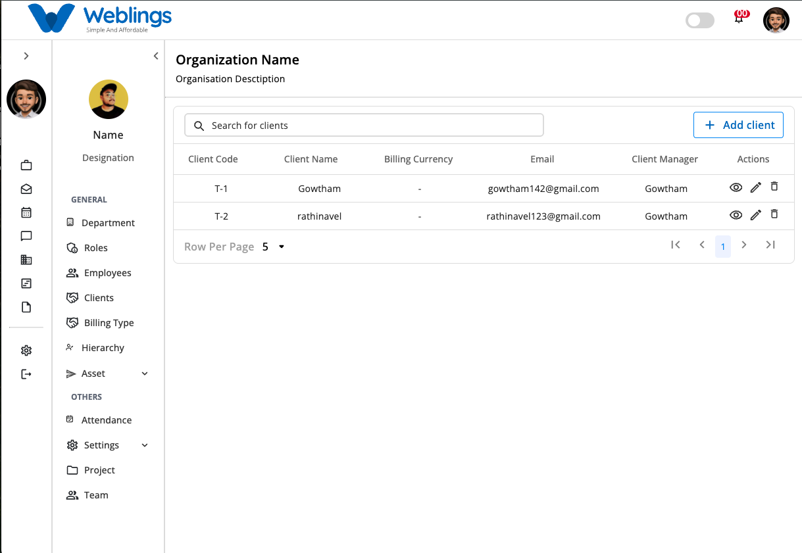
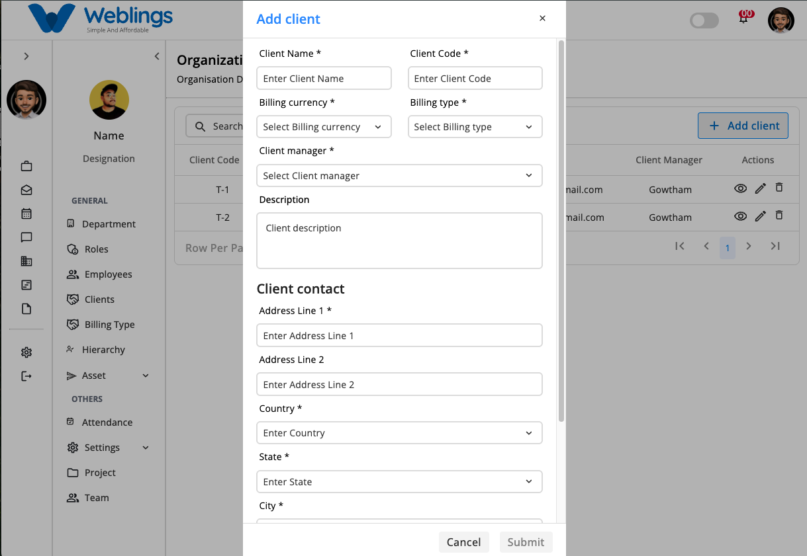
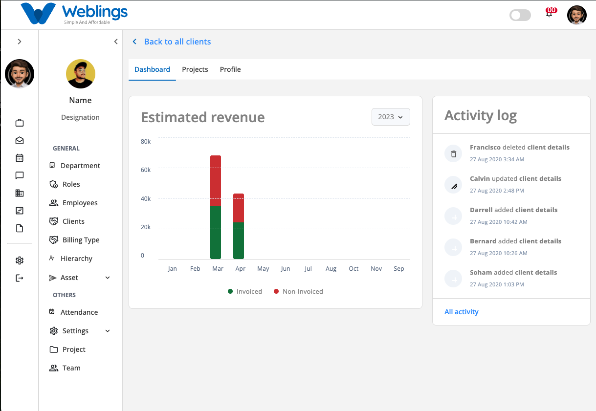
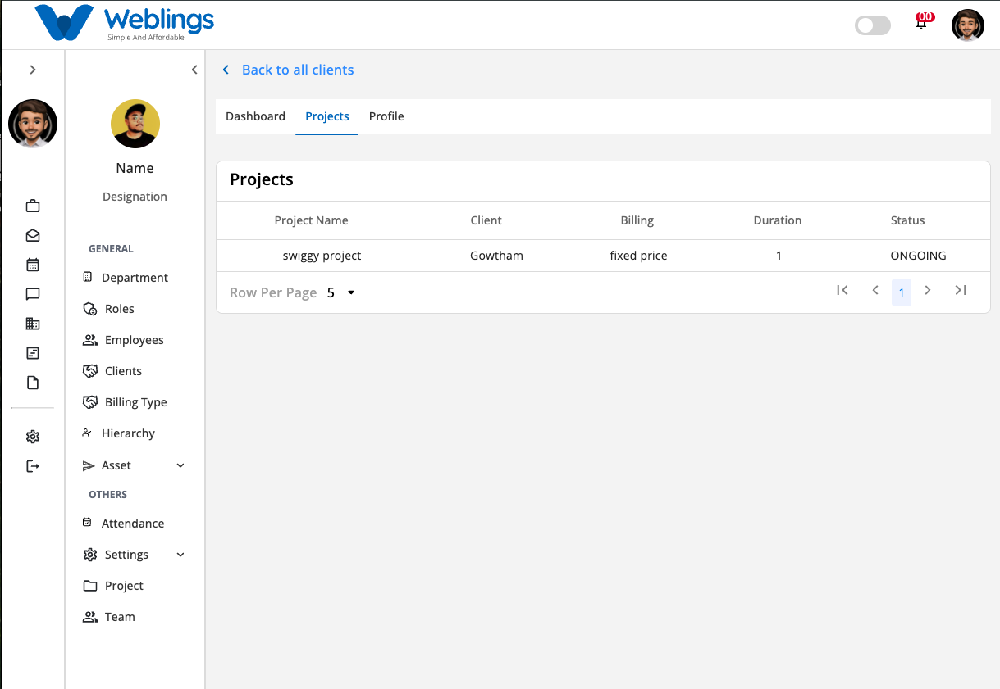
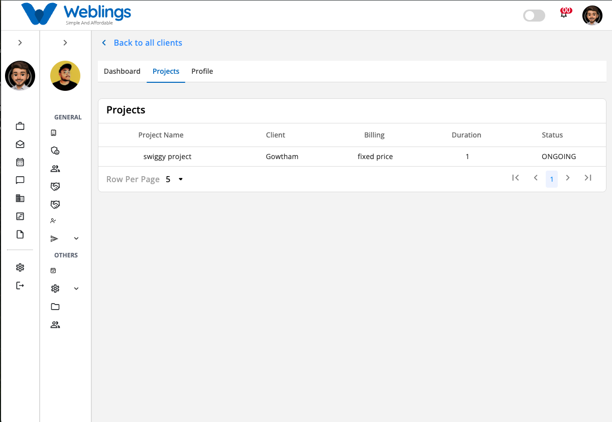
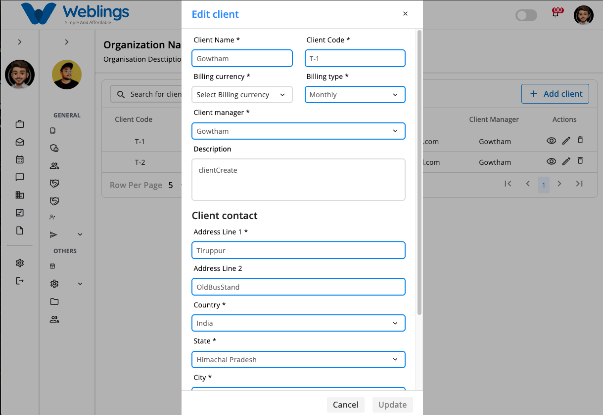
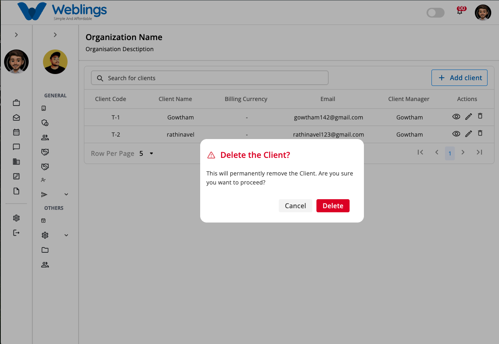

# Clients

The **Clients** screen allows you to manage all client information for your organization. You can add new clients, update existing client details, view complete client information, search for clients, and remove clients that are no longer active.

From this screen, you can:

- View all clients.
- Search for a client.
- Add a new client.
- View client details.
- Edit client information.
- Delete a client.

---

# Client List

The Client table displays all clients created for your organization.

The table includes the following information:

- **Client Code** – A unique code used to identify the client.
- **Client Name** – The client's company or organization name.
- **Billing Currency** – The currency used for billing the client.
- **Email** – Primary contact email address.
- **Client Manager** – Employee responsible for managing the client.
- **Actions** – Options to View, Edit, or Delete the client.

Use the **Search for Clients** box to quickly locate a client by entering the Client Name, Client Code, or Email Address.

---

# Add a Client

To create a new client, click **Add Client**.

The **Add Client** window will open.

## Basic Information

### Client Name

Enter the official name of the client.

**Example:**

- ABC Technologies Pvt Ltd
- Global Solutions Ltd
- Acme Corporation

---

### Client Code

Enter a unique code for the client.

**Examples:**

- CL001
- TCS001
- ABC100

---

### Billing Currency

Select the currency used when billing the client.

**Examples:**

- INR
- USD
- EUR
- GBP

---

### Billing Type

Select how the client will be billed.

**Examples:**

- Fixed Price
- Hourly
- Monthly
- Project Based

---

### Client Manager

Select the employee responsible for managing this client.

---

### Description

Provide a brief description about the client or the services provided.

---

# Client Contact Information

Complete the client's contact details.

### Address Line 1

Enter the primary address.

### Address Line 2 (Optional)

Enter additional address information if applicable.

### Country

Select the client's country.

### State

Select the state or province.

### City

Select the city.

### GST Number (Optional)

Enter the client's GST or Tax Identification Number.

### Email Address

Enter the client's official email address.

### Contact Number

Enter the client's primary contact number.

---

# Save or Cancel

After entering all required information:

- Click **Submit** to save the client.
- Click **Cancel** to close the window without saving.

If all information is valid, the client will be added successfully.

---

# View Client Details

Click the **View** (👁️) icon from the **Actions** column to open the Client Details page.

The Client Details page is divided into three tabs:

- Dashboard
- Projects
- Profile

---

# Dashboard

The **Dashboard** tab provides a quick overview of the client's business performance.

It includes the following sections:

## Estimated Revenue

Displays the client's estimated revenue for the selected year.

The chart compares:

- Invoiced Revenue
- Non-Invoiced Revenue

Use the **Year** dropdown to switch between available financial years.

---

## Activity Log

The Activity Log displays recent actions performed for the client.

Examples include:

- Client created
- Client information updated
- Client deleted
- Project assigned
- Project completed

Click **All Activity** to view the complete activity history.

---

# Projects

Select the **Projects** tab to view all projects associated with the selected client.

The project list includes:

- Project Name
- Client
- Billing Type
- Duration
- Project Status

Use this tab to quickly monitor every project created for the client.

If no projects have been assigned, an empty list will be displayed.

---

# Profile

The **Profile** tab displays complete client information.

The profile includes:

## Basic Information

- Client Name
- Client Code
- Description
- Billing Currency
- Billing Type
- Client Manager

---

## Contact Information

- Address Line 1
- Address Line 2
- Country
- State
- City
- GST Number
- Email Address
- Contact Number

---

## System Information

- Created At
- Updated At
- Created By
- Updated By
- Status Message

The Profile tab is view-only and cannot be edited directly.

To update client information, return to the Client List and click the **Edit** icon.

---

# Edit a Client

To modify client information:

1. Click the **Edit** (✏️) icon.
2. Update the required information.
3. Click **Update** to save your changes.

You can update:

- Client Name
- Client Code
- Billing Currency
- Billing Type
- Client Manager
- Description
- Address
- Country
- State
- City
- GST Number
- Email Address
- Contact Number

Click **Cancel** to discard your changes.

---

# Delete a Client

To remove a client:

1. Click the **Delete** (🗑️) icon.
2. A confirmation dialog will appear.

## Confirmation Message

> **This will permanently remove the Client. Are you sure you want to proceed?**
> 

Choose one of the following options:

### Delete

Permanently removes the client.

### Cancel

Closes the confirmation window without deleting the client.

> **Note:** Clients associated with active projects or invoices should be reassigned or completed before deletion.
> 

---

# Search Clients

Use the **Search for Clients** box to locate a client quickly.

You can search using:

- Client Name
- Client Code
- Email Address

Matching results are displayed automatically as you type.

---

[FAQ](E%20Office/Clients/FAQ%203b47b1088175809d97fec9f859baf2fa.md)