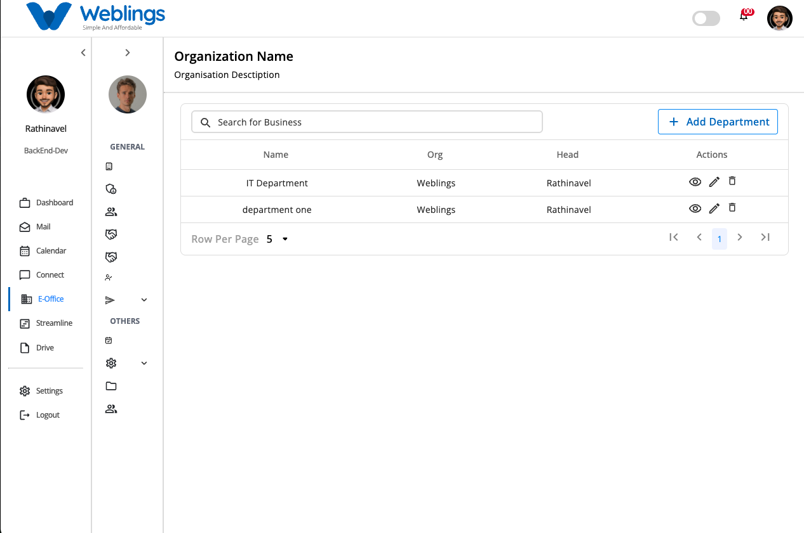

# Department

The **Departments** screen helps you organize your business by creating and managing departments within your selected business unit.

From this screen, you can:

- View all departments.
- Search for a department.
- Create a new department.
- View department details.
- Edit department information.
- Delete a department.

---

# Department List

The Department table displays all departments created for the selected business unit.

The table includes the following information:

- **Name** – The department name.
- **Organization** – The organization to which the department belongs.
- **Head** – The employee assigned as the department head.
- **Actions** – Options to view, edit, or delete the department.

Use the search box at the top of the page to quickly find a department by name.

---

# Create a Department

To create a new department, click **Add Department**.

The **Create Department** page will open.

## Enter Department Information

Fill in the following details:

### Department Name

Enter a unique and meaningful name for the department.

**Example:**

- Human Resources
- Information Technology
- Finance
- Sales

### Description

Enter a short description explaining the purpose or responsibilities of the department.

### Department Head

Select the employee who will manage the department from the **Head** drop-down list.

### Organization

The **Organization** field is filled in automatically based on the organization you signed in to.

This field cannot be changed.

### Business Unit Location

The **Business Unit Location** is automatically selected based on the business location you used to log in.

This field cannot be changed.

---

## Save or Cancel

After entering all required information:

- Click **Submit** to create the department.
- Click **Cancel** to close the page without saving.

If all information is valid, the new department will be added to the Department list.

---

# View Department Details

To view complete information about a department, click the **View** (👁) icon in the **Actions** column.

The Department Details page displays:

- Department Name
- Description
- Organization
- Department Head
- Business Unit Location
- Created By
- Created Date and Time
- Message (if available)

This page is for viewing information only.

---

# Edit a Department

To update department information, click the **Edit** (✏️) icon in the **Actions** column.

You can update the following information:

- Department Name
- Description
- Department Head

The Organization and Business Unit Location remain unchanged.

After making your changes:

- Click **Update** to save the changes.
- Click **Cancel** to discard your changes.

If the information is valid, the department details will be updated successfully.

---

# Delete a Department

To remove a department, click the **Delete** (🗑) icon in the **Actions** column.

Before the department is deleted, a confirmation message will appear.

> **This will permanently remove the Department. Are you sure you want to proceed?**
> 

You can choose one of the following options:

- **Delete** – Permanently removes the department.
- **Cancel** – Closes the confirmation window without deleting the department.

> **Note:** Once a department is deleted, it cannot be recovered.
> 

---

# Search Departments

Use the **Search for Business** box at the top of the page to quickly locate a department.

Start typing the department name, and the table will automatically display matching results.

---

[FAQ](E%20Office/Department/FAQ%203b47b108817580de807bdcecc251cccf.md)