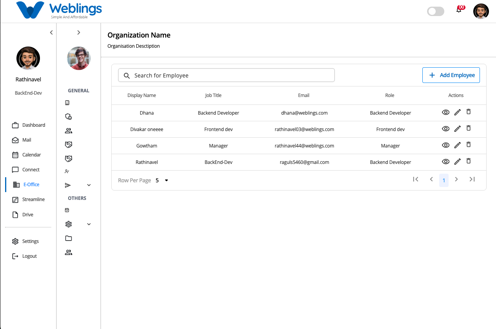

# Employees



# Employees

The **Employees** section allows administrators to manage employee records within the organization. From this screen, you can add new employees, view employee information, update employee details, or remove employees when required.

The Employees page displays a list of all employees in the organization.

Each employee record contains:

- **Display Name** – The name displayed throughout the system.
- **Job Title** – The employee's assigned position.
- **Email** – The employee's organization email address.
- **Role** – The role assigned to the employee.
- **Actions** – View, Edit, and Delete options.

You can also use the **Search** bar to quickly find an employee by entering their display name, email address, or job title.

---

# Add a New Employee

To create a new employee account, click the **Add Employee** button located in the top-right corner of the Employees page.

Employee creation is completed in **four simple steps**.

---

# Step 1 – Basic Details

The first step collects the employee's personal information, organization email, contact details, and role.

## Personal Details

Fill in the following information:

- First Name
- Middle Name (Optional)
- Last Name
- Display Name
- Custom Code
- Gender (Select from the dropdown)
- Date of Birth (Select from the calendar)
- Nationality (Select from the dropdown)

Make sure all information is entered correctly, as these details will be used throughout the organization.

---

## Organization Email

Create the employee's official organization email.

Complete the following fields:

### Email Address

Enter the preferred email name.

Select the organization's email domain.

Click the **Check** button to verify whether the email address is available.

Example:

```
john.smith@company.com
```

If the email address is available, continue with the remaining fields.

### Display Name

Enter the display name that will appear in emails and throughout the application.

### New Password

Create a secure password that meets all of the following requirements:

- Be at least **8 characters** long.
- Include at least **one uppercase letter** (A–Z).
- Include at least **one lowercase letter** (a–z).
- Include at least **one number** (0–9).
- Include at least **one special character**, such as **! @ # $ % & \**.

### Change Password on First Login

If you want the employee to create their own password during their first login, enable the **Change Password on First Login** checkbox.

After completing the email details, click **Create Email**.

---

## Contact Details

Provide the employee's contact information.

Fields include:

- Personal Email
- Alternate Email (Optional)
- Mobile Number
- Alternate Mobile Number (Optional)

---

## Job Title

Assign a role to the employee.

Select the employee's **Role** from the dropdown list.

The selected role determines the employee's access permissions within the system.

After completing all information, click **Next**.

---

# Step 2 – Job Details

The second step records the employee's employment and organization information.

This step contains two sections.

## Job Details

Complete the following fields:

- Joining Date (Select from the calendar)
- Shift Type (Select from the dropdown)

---

## Organizational Details

Assign the employee to the correct organization structure.

Complete the following fields:

- Business Unit (Dropdown)
- Location (Dropdown)

> The available locations depend on the selected Business Unit.
> 
- Department (Dropdown)
- Worker Type (Dropdown)
- Reporting Manager (Dropdown)
- Probation Policy (Dropdown)
- Notice Period (Dropdown)

Once all information has been entered, click **Next**.

---

# Step 3 – Work Details

The Work Details step allows you to assign the employee's work schedule and leave policies.

Complete the following fields:

- Leave Plan (Dropdown)
- Week Off Plan (Dropdown)
- Holiday Plan (Dropdown)
- Asset Assignment (Dropdown)

After completing all required fields, click **Next**.

---

# Step 4 – Compensation Details

The final step records the employee's salary structure.

Complete the following fields:

- Pay Scale (Dropdown)
- Pay Grade (Dropdown)

After reviewing the information, click **Finish**.

The employee will be created successfully and added to the Employees list.

---

# View Employee Details

To view an employee's information, click the **View (Eye)** icon.

The Employee Details page displays all information entered during employee creation, including:

- Personal Details
- Contact Information
- Organization Email
- Job Information
- Organizational Details
- Work Details
- Compensation Details
- Assigned Role
- Department
- Business Unit
- Reporting Manager

This page is read-only and is intended for reviewing employee information.

---

# Edit an Employee

To update an employee's information:

1. Click the **Edit (Pencil)** icon.
2. Modify the required information.
3. Click **Save Changes**.

The employee information will be updated immediately.

If you do not wish to save the changes, click **Cancel**.

---

# Delete an Employee

To remove an employee from the organization:

1. Click the **Delete (Trash)** icon.
2. A confirmation dialog will appear.

**Confirmation Message**

> This will permanently remove the Employee.
> 
> 
> Are you sure you want to proceed?
> 

You will have two options:

- **Cancel** – Return without deleting the employee.
- **Delete** – Permanently remove the employee.

> **Note:** Deleted employee records cannot be recovered.
> 

---

# Search Employees

Use the search bar to quickly find an employee.

You can search using:

- Display Name
- Email Address
- Job Title

The employee list updates automatically to show matching results.

---

[FAQ](E%20Office/Employees/FAQ%203b47b108817580d1b9e0ccae62e0f6c8.md)