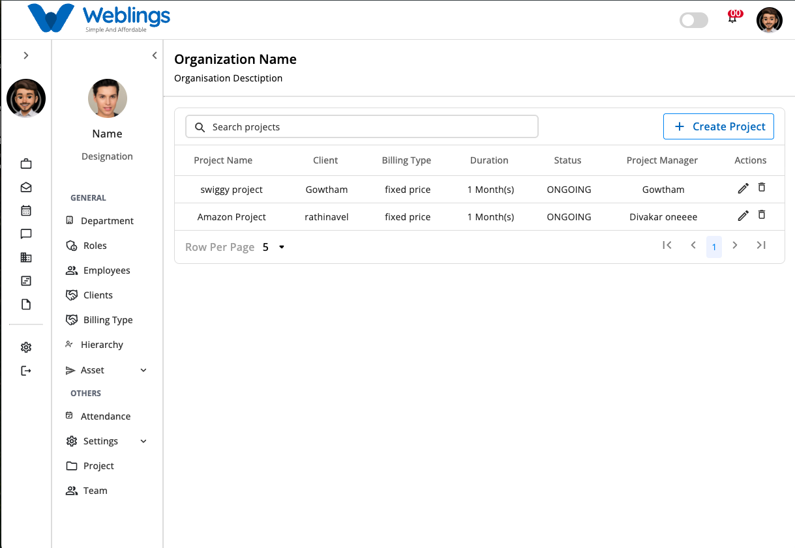
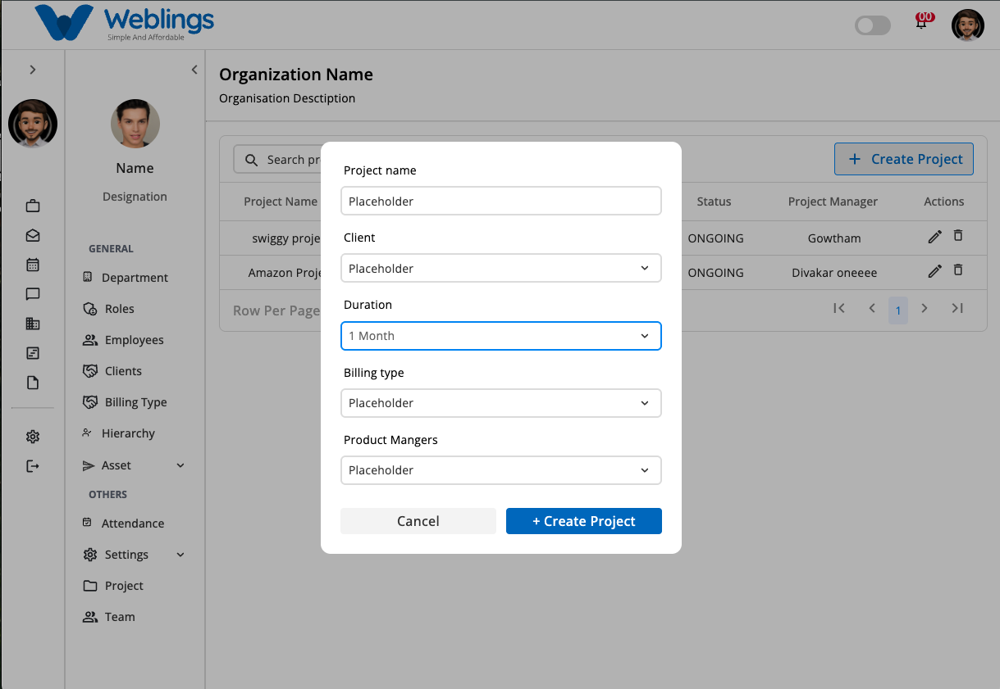
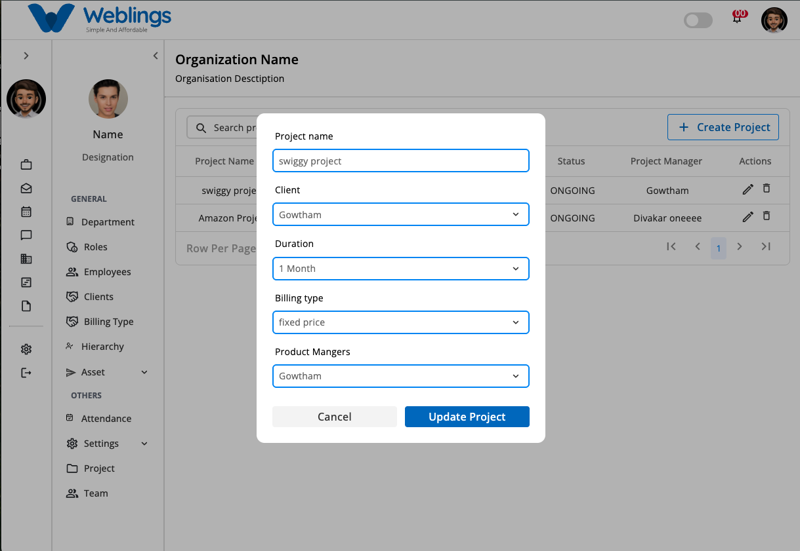
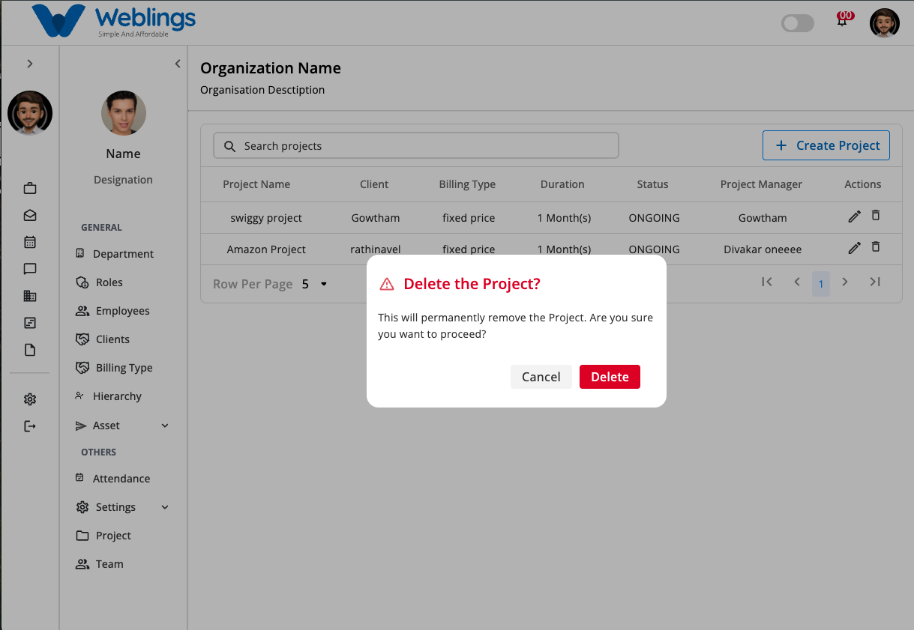

# Project

The **Projects** screen allows you to create, manage, edit, and delete projects within your organization.

## Project List

The Project List displays all available projects in a table format. Each project includes the following details:

- **Project Name** – The name of the project.
- **Client** – The client associated with the project.
- **Billing Type** – The project's billing method.
- **Duration** – The project's start and end dates or overall duration.
- **Status** – The current status of the project.
- **Project Manager** – The employee responsible for managing the project.
- **Actions** – Options to view, edit, or delete the project.

To create a new project:

1. Click the **Create Project** button.
2. The **Create Project** screen will open.

---

## Create Project

The **Create Project** screen allows you to add a new project by entering the required details.

Fill in the following fields:

- **Project Name**
- **Client** – Select a client from the dropdown list.
- **Duration**
- **Billing Type**
- **Project Manager** – Select a project manager from the dropdown list.

After completing all required fields:

1. Click **Create Project** to save the project.
2. Click **Cancel** to discard the changes.

---

## Edit Project

To update an existing project:

1. Click the **Edit** action for the desired project.
2. The **Edit Project** screen will open.

You can modify the following fields:

- **Project Name**
- **Client** – Select a client from the dropdown list.
- **Duration**
- **Billing Type**
- **Project Manager** – Select a project manager from the dropdown list.

After making the necessary changes:

1. Click **Save Changes** to update the project.
2. Click **Cancel** to exit without saving.

---

## Delete Project

To remove a project:

1. Click the **Delete** action for the desired project.
2. A confirmation dialog will appear.

Choose one of the following options:

- **Delete** – Permanently removes the project.
- **Cancel** – Closes the dialog without deleting the project.

---

[FAQ](E%20Office/Project/FAQ%203b47b1088175809984c2e3c5e271c857.md)