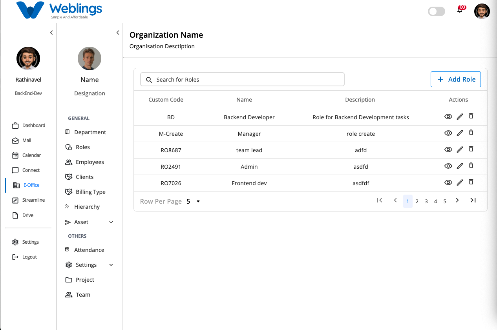

# Roles

# Roles & Permissions

The **Roles & Permissions** section allows administrators to create, manage, and control user roles within the organization. Each role defines what actions a user is allowed to perform in different modules of the E-Office system.

The Roles page displays a list of all available roles in your organization.

Each role includes the following information:

- **Custom Code** – A unique code used to identify the role.
- **Role Name** – The name of the role.
- **Description** – A short explanation of the role's purpose.
- **Actions** – Options to View, Edit, or Delete the role.

You can also use the **Search** bar to quickly find a role by entering its name or custom code.

---

# Create a New Role

To create a new role, click the **Add Role** button located in the top-right corner of the Roles page.

The **Create New Role** screen will open.

## Step 1: Enter Role Information

Complete the following fields:

### Role Name

Enter a meaningful name for the role.

**Example:**

- HR Manager
- Team Lead
- Project Manager
- Backend Developer

### Custom Code

Enter a unique code for the role.

**Example:**

- HR001
- PM001
- TL001

### Description

Provide a brief description explaining the responsibilities of the role.

**Example:**

> This role is responsible for managing employee attendance, approving leave requests, and monitoring team activities.
> 

---

## Step 2: Assign Permissions

After entering the role details, assign permissions to the role.

The left panel displays the available system modules, while the right panel displays the permissions available for the selected module.

You can also use the **Search Permissions** box to quickly find a permission.

Permissions are grouped by features such as:

- Team
- Clients
- Projects
- Employees
- Attendance
- Departments
- Billing
- Assets
- Leave
- Calendar
- Mail
- Dashboard
- and other available modules.

For each module, you can assign permissions such as:

- Create
- View
- View All
- Edit
- Delete

Simply check the permissions that the role should have.

The selected permission count is displayed beside each feature, making it easy to track how many permissions have been assigned.

---

## Step 3: Save the Role

After entering the role details and selecting the required permissions:

Click **Create** to save the new role.

The role will immediately appear in the Roles list.

If you do not wish to create the role, click **Cancel** to return to the previous screen without saving any changes.

---

# View Role Details

To view a role, click the **View (Eye)** icon.

The Role Details page displays:

- Role Name
- Custom Code
- Description
- Date Created (if available)
- List of assigned permissions
- Features the role can access
- Actions the role is allowed to perform

This screen is read-only and helps you review the role configuration.

---

# Edit a Role

To modify an existing role:

1. Click the **Edit (Pencil)** icon.
2. Update any of the following information:
    - Role Name
    - Custom Code
    - Description
    - Assigned Permissions
3. Add or remove permissions as needed.
4. Click **Save Changes** to update the role.

The updated information will immediately be reflected in the Roles list.

If you do not want to save your changes, click **Cancel** to return to the previous screen.

---

# Delete a Role

To permanently remove a role:

1. Click the **Delete (Trash)** icon.
2. A confirmation message will appear.

**Confirmation Message**

> This will permanently remove the user's role.
> 
> 
> Are you sure you want to proceed?
> 

You will have two options:

- **Cancel** – Return without deleting the role.
- **Delete** – Permanently remove the selected role.

> **Note:** Once deleted, the role and all of its assigned permissions cannot be recovered.
> 

---

# Search Roles

The search bar helps you quickly locate a role.

You can search using:

- Role Name
- Custom Code

The list updates automatically to display matching results.

---

[FAQ](E%20Office/Roles/FAQ%203b47b108817580268a6aeb596cb1b472.md)