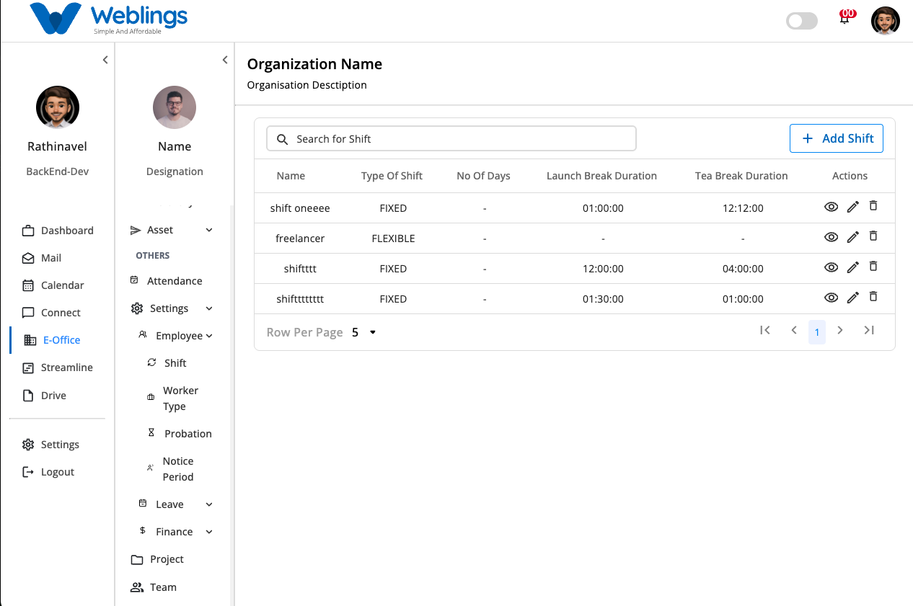

# Shift

# Shift Management

The **Shift Management** screen helps you create, manage, and organize employee work shifts. You can define working days, working hours, tea break duration, and lunch break duration for each shift. Employees assigned to a shift will follow the schedule configured here.

The screen displays a list of all available shifts with the following information:

- Shift Name
- Shift Type (Fixed or Flexible)
- Number of Working Days
- Lunch Break Duration
- Tea Break Duration
- Actions (View, Edit, Delete)

You can also use the **Search** bar to quickly find a shift by its name.

---

# Create a New Shift

To create a new shift, click the **Add Shift** button located at the top-right corner of the screen.

The **New Shift** page will open.

## Step 1: Enter Shift Information

Fill in the following details:

### Shift Name

Enter a meaningful name for the shift.

**Example:**

- Morning Shift
- General Shift
- Customer Support Shift
- Night Shift

### Custom Code

Enter a unique code that helps identify the shift.

**Example:**

- MS001
- GS101
- NS001

### Select Shift Type

Choose one of the following:

- **Fixed Shift** – Employees work the same schedule every working day.
- **Flexible Shift** – Employees can work flexible timings based on company policy.

---

## Step 2: Configure Shift Timings

Choose the working days by selecting the required day buttons.

Available days:

- Monday
- Tuesday
- Wednesday
- Thursday
- Friday
- Saturday
- Sunday

Only the selected days will be treated as working days.

---

### Shift Timing

Select the daily working hours.

Choose:

- Shift Start Time
- Shift End Time

Example:

- Start Time: **09:00 AM**
- End Time: **06:30 PM**

---

### Tea Break

Enter the duration of the tea break.

Example:

- 15 Minutes
- 30 Minutes

---

### Lunch Break

Enter the duration of the lunch break.

Example:

- 30 Minutes
- 1 Hour

---

## Step 3: Save the Shift

After completing all the required details:

Click **Submit**.

The new shift will be created and added to the Shift Management list.

If you do not want to create the shift, click **Cancel** to return to the previous screen without saving.

---

# View Shift Details

Click the **View** (👁️) icon beside any shift to see its complete information.

The details page displays:

- Shift Name
- Custom Code
- Shift Type
- Working Days
- Shift Start Time
- Shift End Time
- Tea Break Duration
- Lunch Break Duration
- Created At
- Business Unit location
- Created By
- Updated By
- Message

This page is for viewing only and cannot be edited.

---

# Edit a Shift

If you need to change an existing shift:

1. Click the **Edit** (✏️) icon.
2. The **Edit Shift** page will open.
3. Update any of the following details:
    - Shift Name
    - Custom Code
    - Shift Type
    - Working Days
    - Shift Timing
    - Tea Break Duration
    - Lunch Break Duration
4. After making your changes, click **Update**.

The updated shift information will be saved immediately.

If you decide not to save the changes, click **Cancel** to return without updating the shift.

---

# Delete a Shift

If a shift is no longer required:

1. Click the **Delete** (🗑️) icon.
2. A confirmation message will appear.

**Message**

> This will permanently remove the shift. Are you sure you want to proceed?
> 

You will see two options:

- **Cancel** – Return without deleting the shift.
- **Delete** – Permanently remove the selected shift.

> **Note:** Deleting a shift cannot be undone. Make sure the shift is no longer assigned to employees before deleting it
> 

---

[FAQ](E%20Office/Settings/Employee/Shift/FAQ%203b47b108817580faa932ff8b7067c301.md)