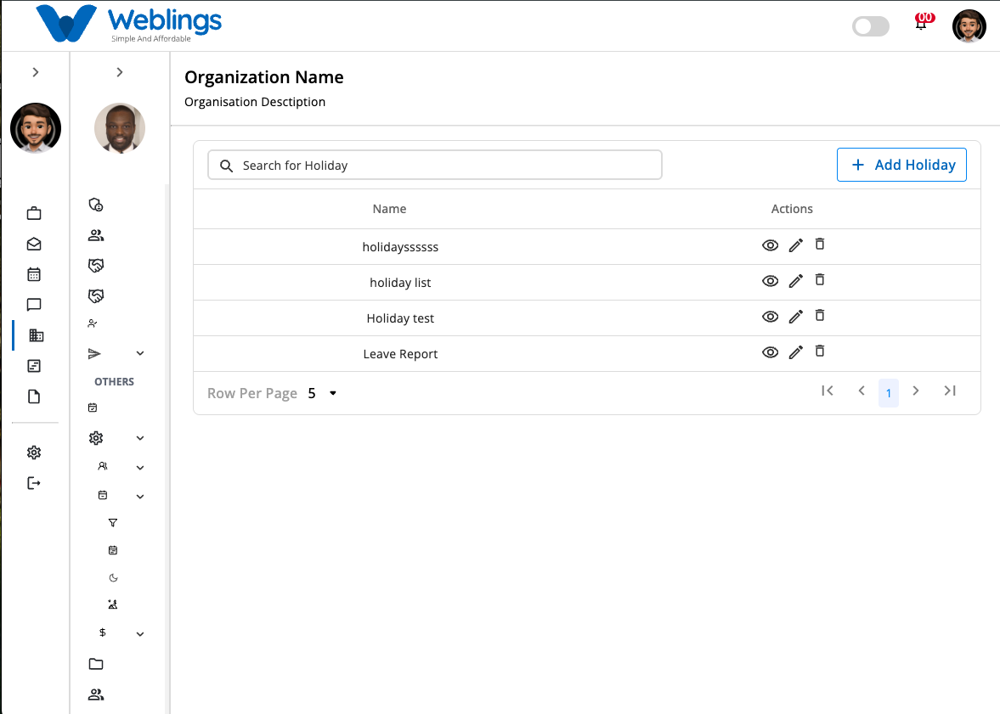
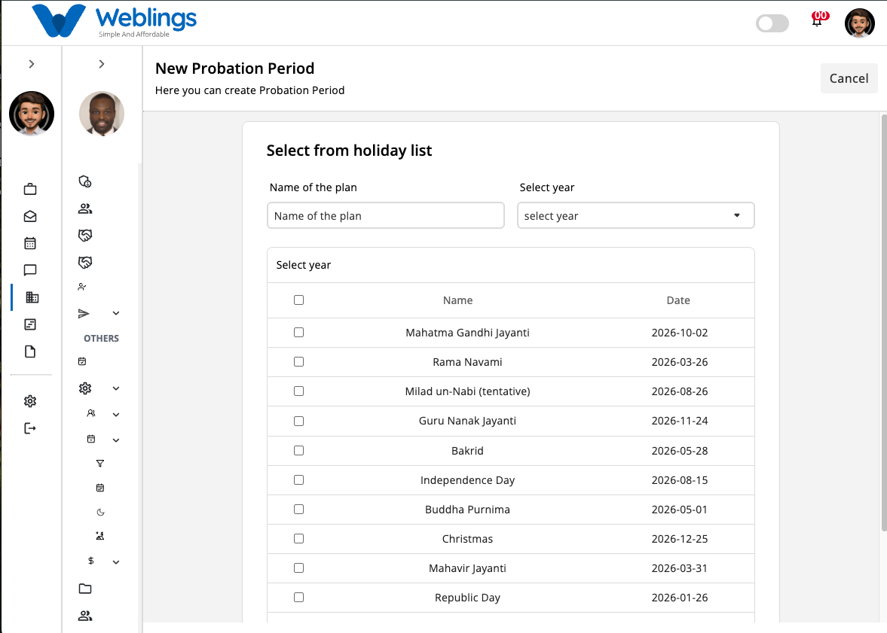
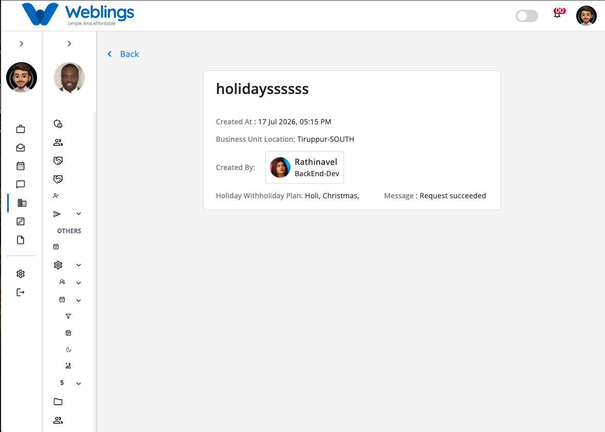
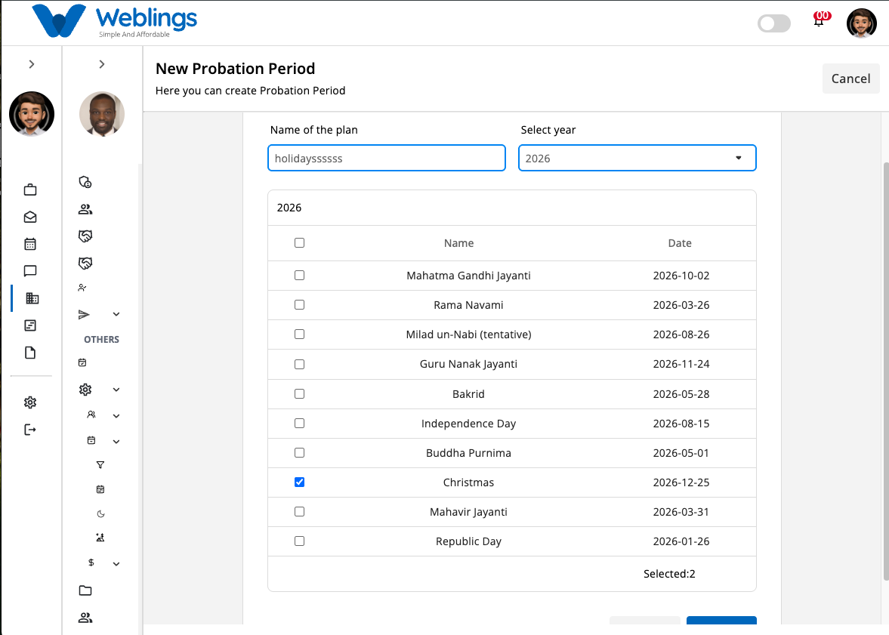

# Holiday

# Holiday

The **Holiday** screen allows you to create and manage holiday plans for your organization. A holiday plan helps define official holidays for a specific year and can be assigned to employees or business locations.

The Holiday list displays all available holiday plans with the following information:

- Holiday Plan Name
- Actions (View, Edit, Delete)

You can also use the **Search Holiday** bar to quickly find a holiday plan by entering its name.

---

# Create a New Holiday Plan

To create a new holiday plan, click the **Add Holiday** button in the top-right corner of the screen.

The **New Holiday Plan** page will open.

## Holiday Plan Details

Complete the following information:

### Holiday Plan Name

Enter a unique and meaningful name for the holiday plan.

**Examples:**

- India Holidays 2026
- Corporate Holiday Calendar 2027
- Chennai Office Holidays

### Select Year

Choose the year for which the holiday plan will be created.

After selecting a year, a list of holidays for that year will be displayed.

Example:

- ☑ Mahatma Gandhi Jayanti — 2026-10-02
- ☑ Republic Day — 2026-01-26
- ☑ Independence Day — 2026-08-15

Select the holidays you want to include in the holiday plan.

---

## Save or Cancel

After selecting the required holidays:

### Submit

Click **Submit** to create the holiday plan.

The new holiday plan will be added to the Holiday list.

### Cancel

Click **Cancel** to return to the previous screen without saving.

---

# View Holiday Plan

To view a holiday plan:

1. Click the **View** (👁️) icon from the **Actions** column.

The details page displays:

- Holiday Plan Name
- Created Date & Time
- Business Unit Location
- Created By
- Selected Holidays
- Status Message

This page is for viewing information only and cannot be edited.

---

# Edit a Holiday Plan

To update an existing holiday plan:

1. Click the **Edit** (✏️) icon.
2. The **Edit Holiday Plan** page will open.
3. Update any of the following:
    - Holiday Plan Name
    - Selected Year
    - Selected Holidays
4. Click **Update** to save your changes.

The updated information will be reflected immediately in the Holiday list.

If you do not wish to save your changes, click **Cancel**.

---

# Delete a Holiday Plan

To remove a holiday plan:

1. Click the **Delete** (🗑️) icon.
2. A confirmation dialog will appear.

## Confirmation Message

> **This will permanently remove the holiday plan. Are you sure you want to proceed?**
> 

You will have two options:

### Cancel

Return without deleting the holiday plan.

### Delete

Permanently remove the selected holiday plan.

> **Note:** Deleting a holiday plan cannot be undone. Ensure the holiday plan is no longer assigned to any employees, work schedules, or leave policies before deleting it.
> 

---

[FAQ](E%20Office/Settings/Leave/Holiday/FAQ%203b47b108817580cdb73fcccfd3611359.md)