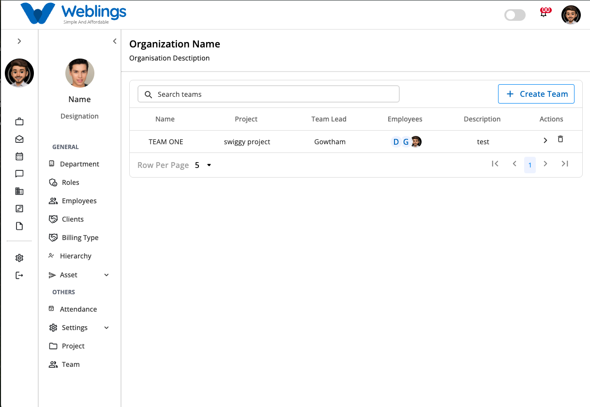
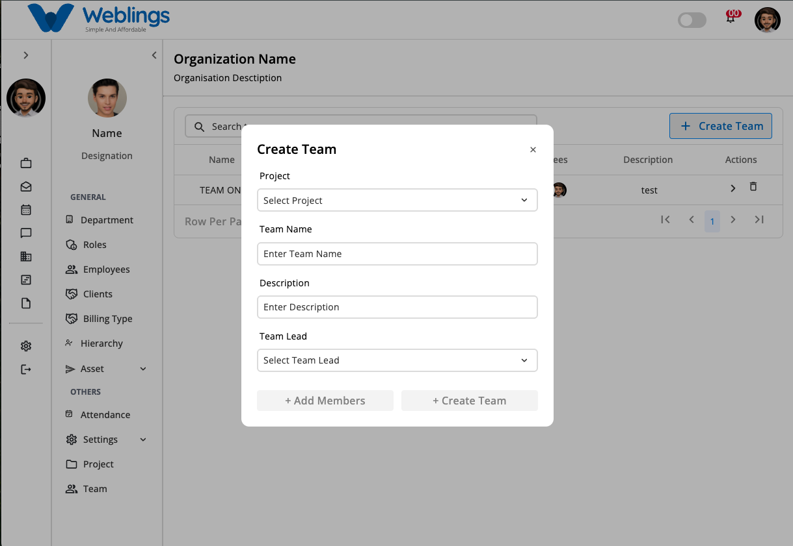
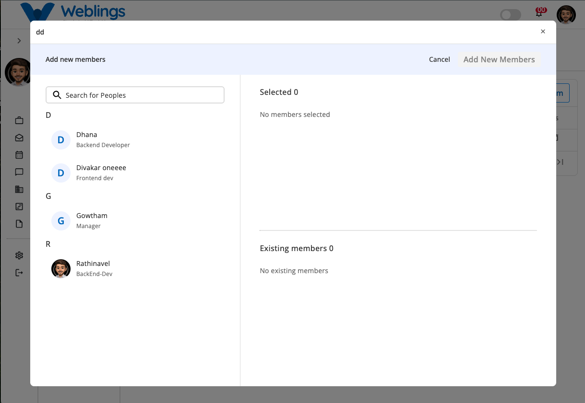
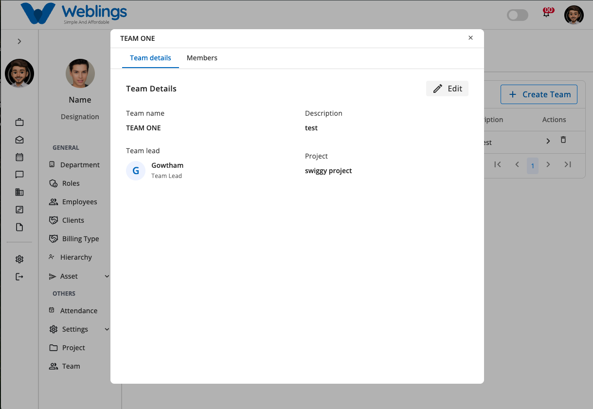
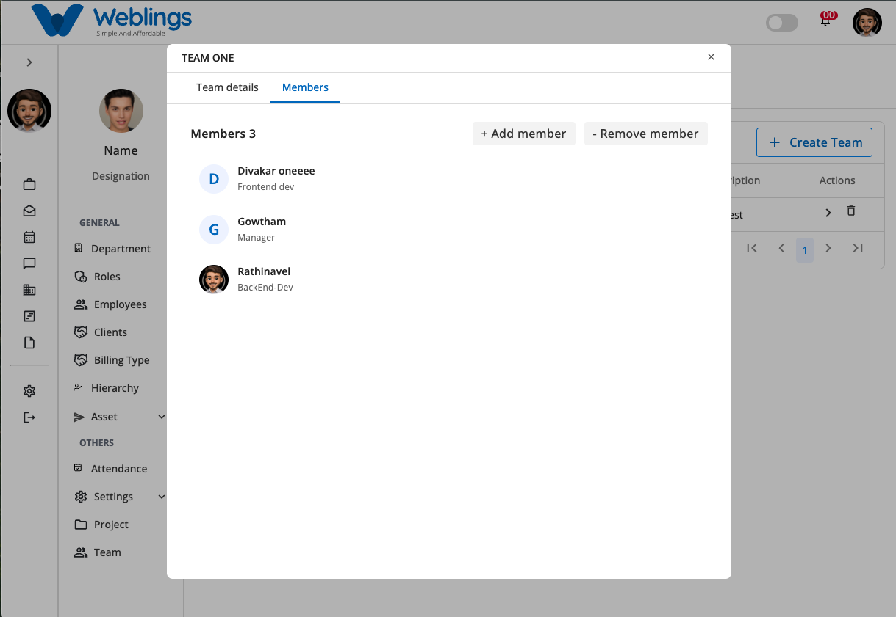
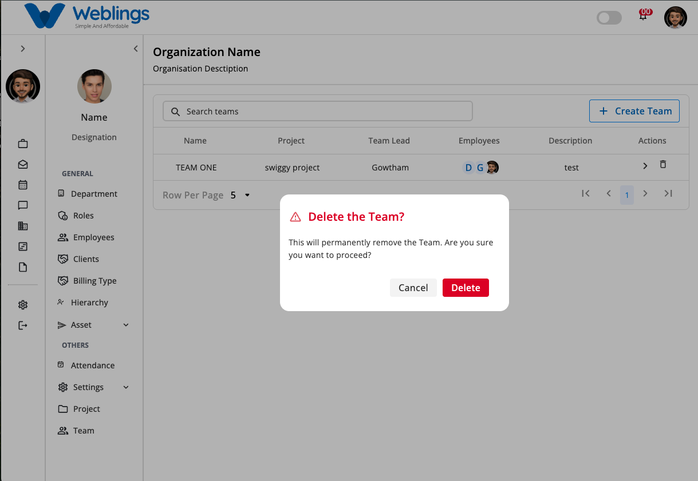

# Team

The **Teams** screen allows you to create, manage, update, and delete teams within your organization.

## Team List

The Team List displays all teams in a table format. Each team includes the following information:

- **Team Name** – The name of the team.
- **Project** – The project assigned to the team.
- **Team Lead** – The employee leading the team.
- **Employees** – The total number of team members.
- **Description** – A brief description of the team.
- **Actions** – Options to edit or delete the team.

To create a new team:

1. Click the **Create Team** button.
2. The **Create Team** modal will open.

---

## Create Team

The **Create Team** modal allows you to create a new team.

Complete the following fields:

- **Project** – Select a project from the dropdown list.
- **Team Name**
- **Description**
- **Team Lead** – Select a team lead from the dropdown list.

After completing all the required fields, the following buttons become available:

- **Add Members**
- **Create Team**

### Add Members

To add members to the team:

1. Click the **Add Members** button.
2. The **Add New Members** modal will open.
3. Use the **Search** bar to find employees.
4. Select one or more employees.
5. Click **Add New Members** to add the selected employees to the team.

After the members are added:

- The **Add Members** button displays the total number of selected members.
- If you decide not to add members, click **Cancel** to close the modal without making any changes.

### Create Team

After entering the team details and adding members (optional):

1. Click **Create Team**.
2. The new team will be created and added to the Team List.

---

## Edit Team

To update an existing team:

1. Click the **Edit** action for the desired team.
2. The **Edit Team** modal will open.

The Edit Team modal contains two tabs:

### Team Details

The **Team Details** tab allows you to modify:

- **Project**
- **Team Name**
- **Description**
- **Team Lead**

Click **Save Changes** to update the team.

### Members

The **Members** tab allows you to manage team members.

You can:

- Add new members to the team.
- Remove existing members from the team.

After making the required changes, click **Save Changes** to update the team.

---

## Delete Team

To delete a team:

1. Click the **Delete** action for the desired team.
2. A confirmation dialog will appear.

Choose one of the following options:

- **Delete** – Permanently removes the team.
- **Cancel** – Closes the dialog without deleting the team.

---

[FAQ](E%20Office/Team/FAQ%203b47b10881758059ae1ac3553cf98424.md)