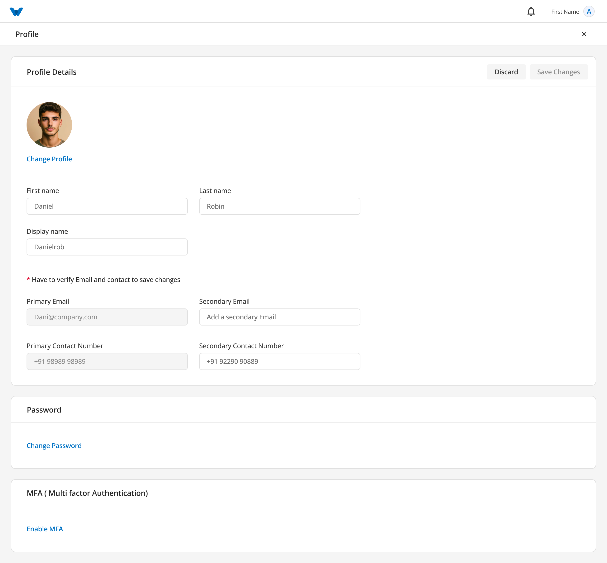
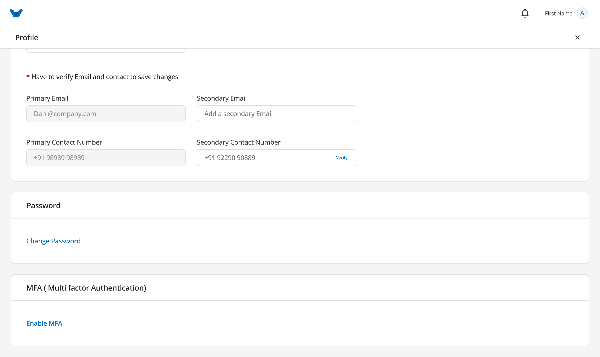

# Profile


You can manage your personal account information from the **Profile** page.

To open your profile, click your **profile picture (avatar)** in the top-right corner of the application and select **Profile**.

The Profile page allows you to view and update your personal information.

---

# Personal Information

The following details are displayed on the Profile page:

- First Name
- Last Name
- Display Name
- Profile Picture
- Primary Email Address
- Secondary Email Address
- Primary Contact Number
- Secondary Contact Number

# Verify Secondary Email Address

After entering your secondary email address, click **Verify** next to the email field.

A **One-Time Password (OTP)** will be sent to the secondary email address you entered.

At the same time, the website will display the **Verify OTP** page.

## Step 1

Open the inbox of your secondary email address.

Find the email containing the OTP.

If you cannot find the email, check your **Spam**, **Junk**, or **Promotions** folder.

---

## Step 2

Return to the **Verify OTP** page.

Enter the OTP exactly as it appears in the email.

Click **Verify**.

If the OTP is correct, your secondary email address will be verified successfully.

The **Verify** status will change to **Verified**.

> **Note:** If you do not receive the OTP, you can request a new one by clicking **Resend OTP**. The **Resend OTP** option becomes available after **60 seconds**.
> 

---

# Verify Secondary Contact Number

After entering your secondary contact number, click **Verify** next to the contact number field.

A **One-Time Password (OTP)** will be sent to your mobile number via SMS.

At the same time, the website will display the **Verify OTP** page.

## Step 1

Open the SMS message on your mobile phone.

Find the message containing the OTP.

---

## Step 2

Return to the **Verify OTP** page on the website.

Enter the OTP exactly as it appears in the SMS.

Click **Verify**.

If the OTP is correct, your secondary contact number will be verified successfully.

The **Verify** status will change to **Verified**.

> **Note:** If you do not receive the OTP, you can request a new one by clicking **Resend OTP**. The **Resend OTP** option becomes available after **60 seconds**.
> 

If you need to update any of your information, click **Edit**, make the necessary changes, and then click **Save Changes**.

---

# Change Profile Picture

You can personalize your account by changing your profile picture.

To update your profile picture:

1. Click on your current profile picture.
2. Select an image from your device.
3. Preview the selected image.
4. Click **Save Changes**.

Your new profile picture will be displayed throughout the application.

---

# Change Password

To keep your account secure, you can change your password at any time.

## Step 1: Verify Your Current Password

Before creating a new password, you must verify your current password.

1. Enter your current password.
2. Click **Verify**.

If your current password is correct, you can continue to create a new password.

---

## Step 2: Create a New Password

Enter your new password and confirm it by entering it again.

Your new password must meet the following requirements:

- Be at least 8 characters long.
- Include at least one uppercase letter (A–Z).
- Include at least one lowercase letter (a–z).
- Include at least one number (0–9).
- Include at least one special character (such as !, @, #, $, %, &, or *).

Once all requirements are met, click **Change Password**.

---

# Verify Your Identity

To keep your account secure, you must verify your identity before your password can be changed.

After clicking **Change Password**, a **One-Time Password (OTP)** will be sent to your **registered mobile number** via SMS.

At the same time, the website will display the **Verify OTP** page.

## Step 1

Check your mobile phone for the SMS containing the OTP.

## Step 2

Return to the **Verify OTP** page on the website.

Enter the OTP exactly as it appears in the SMS.

## Step 3

Click **Verify**.

If the OTP is correct, your password will be updated successfully, and you can sign in using your new password.

---

## Didn't Receive the OTP?

If you haven't received the OTP:

- Wait a few moments, as SMS delivery may take a short time.
- Make sure your registered mobile number can receive SMS messages.
- Ensure your phone has network coverage.

If you still haven't received the OTP, click **Resend OTP** to request a new verification code.

> **Note:** The **Resend OTP** option becomes available after **60 seconds**. If your OTP expires or you do not receive it, you can request a new OTP and try again.
> 

---

# Multi-Factor Authentication (MFA)



Multi-Factor Authentication (MFA) provides an extra layer of security for your account.

When MFA is enabled, you will be asked to enter a verification code sent to your registered authentication email each time you sign in. This helps protect your account from unauthorized access.

You can enable or disable MFA at any time from the **Profile** page.

---

# Enable Multi-Factor Authentication

To enable MFA, click **Enable MFA**.

A window will open asking you to enter the email address where you would like to receive authentication codes.

## Step 1

Enter a valid email address.

This email address will be used to receive verification codes whenever you sign in.

After entering your email address, click **Send OTP**.

---

## Step 2

A **One-Time Password (OTP)** will be sent to the email address you entered.

At the same time, the website will display the **Verify OTP** page.

Open your email inbox and find the email containing the OTP.

If you cannot find the email, check your **Spam**, **Junk**, or **Promotions** folder.

---

## Step 3

Return to the **Verify OTP** page.

Enter the OTP exactly as it appears in the email.

Click **Verify**.

If the OTP is correct, Multi-Factor Authentication will be enabled successfully.

A confirmation message stating **"MFA Enabled Successfully"** will be displayed.

The Profile page will now show:

- **Connected Email** – The email address you entered for authentication.
- **MFA Status** – Enabled.
- **Turn Off MFA** button.

---

## Didn't Receive the OTP?

If you haven't received the OTP:

- Wait a few moments, as email delivery may take a short time.
- Check your **Spam**, **Junk**, or **Promotions** folder.
- Make sure you entered the correct email address.

If you still haven't received the OTP, click **Resend OTP**.

> **Note:** The **Resend OTP** option becomes available after **60 seconds**.
> 

---

# Disable Multi-Factor Authentication

If you no longer wish to use MFA, click **Turn Off MFA**.

To protect your account, you must verify your identity before MFA can be disabled.

## Step 1

A **One-Time Password (OTP)** will be sent to your connected authentication email address.

At the same time, the website will display the **Verify OTP** page.

---

## Step 2

Open your email inbox and find the OTP.

Return to the website and enter the OTP.

Click **Verify**.

If the OTP is correct, MFA will be disabled successfully.

A confirmation message stating **"MFA Disabled Successfully"** will be displayed.

Your account will now require only your email address and password when signing in.

---

## Didn't Receive the OTP?

If you do not receive the OTP:

- Wait a few moments for the email to arrive.
- Check your **Spam**, **Junk**, or **Promotions** folder.
- Click **Resend OTP** to receive a new verification code.

> **Note:** The **Resend OTP** option becomes available after **60 seconds**.
> 

---

# Workflow

```
Open Profile
      ↓
Click "Enable MFA"
      ↓
Enter Authentication Email
      ↓
Click "Send OTP"
      ↓
Receive OTP via Email
      ↓
Enter OTP
      ↓
Click "Verify"
      ↓
MFA Enabled Successfully
      ↓
Connected Email Displayed
      ↓
Future Logins Require an Authentication Code
```

---

# Disable MFA Workflow

```
Click "Turn Off MFA"
      ↓
Receive OTP via Email
      ↓
Enter OTP
      ↓
Click "Verify"
      ↓
MFA Disabled Successfully
```

---

# Save Your Changes

After updating your profile information, click **Save Changes** to apply the updates.

A confirmation message will be displayed once your changes have been saved successfully.

---

# Workflow

```
Open Profile
      ↓
View or Edit Personal Information
      ↓
Save Changes
      ↓
OR
      ↓
Verify Current Password
      ↓
Create New Password
      ↓
Receive OTP via Email
      ↓
Enter OTP
      ↓
Password Updated Successfully
```

---

# Quick Summary

From the **Profile** page, you can:

- View your personal information.
- Update your profile details.
- Change your profile picture.
- Update your contact information.
- Change your password securely.
- Verify your identity using an OTP.
- Manage Multi-Factor Authentication (MFA) settings.

[FAQ](Organization/Profile/FAQ%203b47b108817580a78256f2d905b7d93e.md)