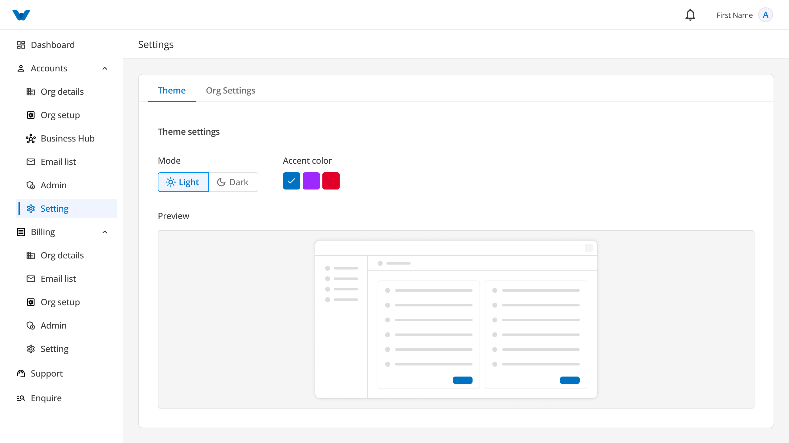
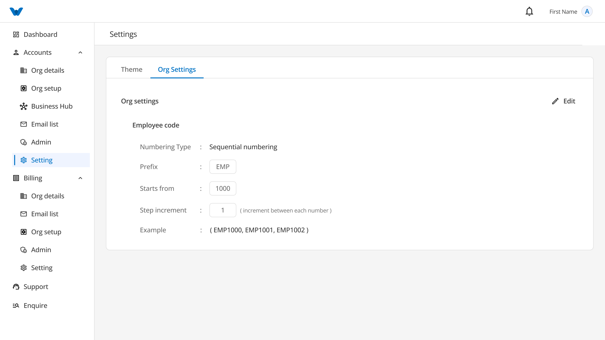

# Settings



The **Settings** section allows you to personalize the appearance of the application and manage your organization's preferences.

The Settings page contains two tabs:

- Theme
- Organization Settings

---

# Theme

The **Theme** tab lets you customize how the application looks.

You can choose the appearance that is most comfortable for you while using the application.

## Available Theme Options

### Light Mode

Light Mode displays the application using a bright background with dark text. It is ideal for use in well-lit environments.

### Dark Mode

Dark Mode displays the application using a dark background with light text. It helps reduce eye strain, especially in low-light environments.

### Accent Color

Choose an accent color to personalize the appearance of buttons, menus, and other highlighted elements throughout the application.

### Preview

As you select a theme or accent color, a preview is displayed so you can see how the application will look before saving your changes.

Once you are satisfied with your selection, click **Save Changes** to apply the new appearance.

---

# Organization Settings



The **Organization Settings** tab allows you to configure how employee codes are generated within your organization.

Employee codes help uniquely identify each employee.

## Employee Code Settings

### Numbering Type

Choose how employee numbers should be generated.

For example:

- Automatic Numbering
- Manual Numbering

### Prefix

Enter the letters or characters that should appear at the beginning of every employee code.

**Example:**

```
EMP
```

An employee code may look like:

```
EMP0001
```

### Start From

Choose the starting number for employee codes.

For example, if you enter **1001**, the first employee code will begin from that number.

### Step Increment

Choose how much the number should increase for each new employee.

For example:

- Start From: **1001**
- Step Increment: **1**

Employee codes will be generated as:

```
EMP1001
EMP1002
EMP1003
```

### Example

The **Example** section displays a sample employee code based on your current settings, allowing you to review the format before saving.

---

# Save or Discard Changes

After making changes to either the **Theme** or **Organization Settings**, you can choose one of the following options:

### Save Changes

Click **Save Changes** to apply and save your updates.

A confirmation message will be displayed once your changes have been saved successfully.

### Discard

Click **Discard** if you do not want to keep your changes.

Any unsaved changes will be removed, and the previous settings will remain unchanged.

---

# Workflow

```
Open Settings
      ↓
Choose Theme or Organization Settings
      ↓
Update Your Preferences
      ↓
Preview Changes (Theme Only)
      ↓
Click "Save Changes"
      ↓
Settings Updated Successfully
```

---

# Quick Summary

The **Settings** section allows you to:

- Switch between Light Mode and Dark Mode.
- Select your preferred accent color.
- Preview the application's appearance before applying changes.
- Configure employee code numbering for your organization.
- Save or discard your changes at any time.

[FAQ](Organization/Settings/FAQ%203b47b10881758052a7eadf784630671a.md)