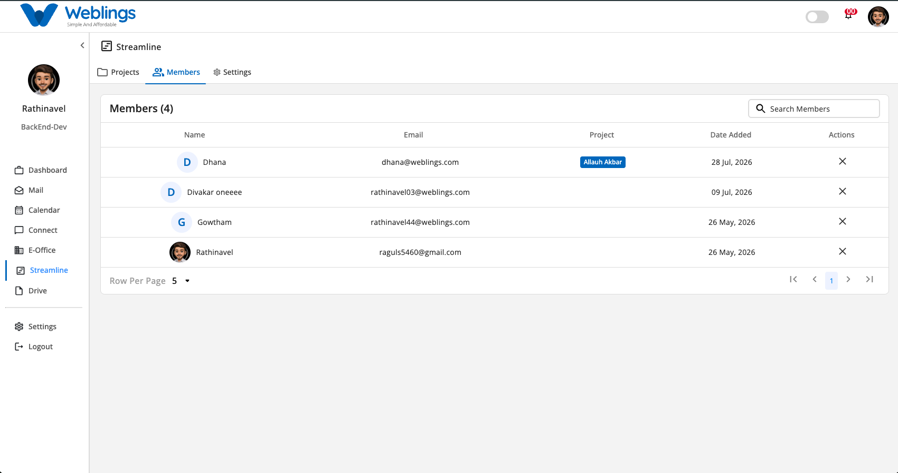
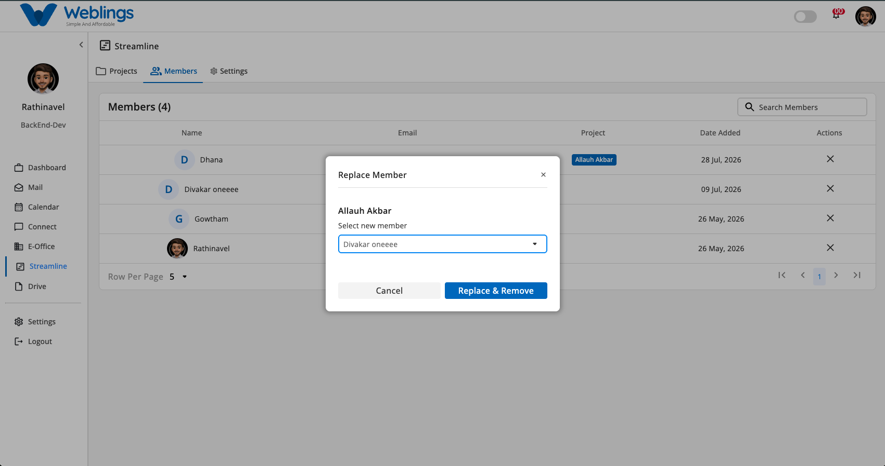

# Members

# Global Members Management

The Members screen under Streamline provides a centralized directory of all organization employees and team members across projects. It allows project administrators to manage employee information, view assigned projects, and safely handle member offboarding or replacement.

The screen displays a global **Members** table with the following information:

- **Name:** Member avatar and full name.
- **Email:** Associated email address.
- **Project:** Assigned project badge(s) associated with the member (e.g., *Allauh Akbar*).
- **Date Added:** Date the member was added to the organization directory.
- **Actions:** Action button (`✕`) to trigger member removal and task reassignment.

You can also use the **Search Members** bar to quickly find employees by name or email, and adjust pagination using **Row Per Page**.

---

## Replacing and Removing a Member

To ensure workflow continuity and prevent orphaned task assignments across active projects, **a member cannot be directly deleted without assigning a replacement**.

If a member is deleted without designating a replacement, any tasks or epics assigned to them will lose their assignee, directly affecting project tracking and task ownership. Therefore, the system enforces a mandatory replacement step before removal.

### Step-by-Step Member Removal Process

1. Locate the employee you wish to remove from the **Members** list.
2. Click the remove action button (`✕`) in the **Actions** column next to their name.
3. The **Replace Member** modal will open:
    - **Project Title Header:** Displays the project name(s) the member is currently assigned to (e.g., *Allauh Akbar*).
    - **Select new member:** Click the dropdown menu to select a replacement team member (e.g., *Divakar oneeee*).
4. Once a replacement member is selected, the **Replace & Remove** button will become active.
5. Click **Replace & Remove** to reassign all active tasks to the new member and permanently remove the original member.
6. If you do not wish to proceed with the removal, click **Cancel** to close the modal without making changes.

---

[FAQ](Members/FAQ%203b87b10881758050be06d8274ca6f781.md)