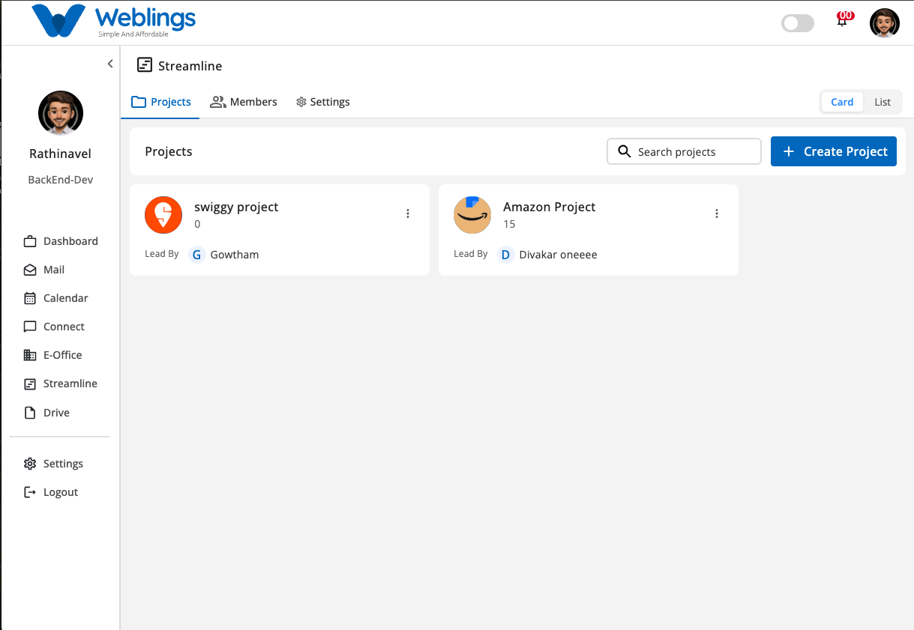
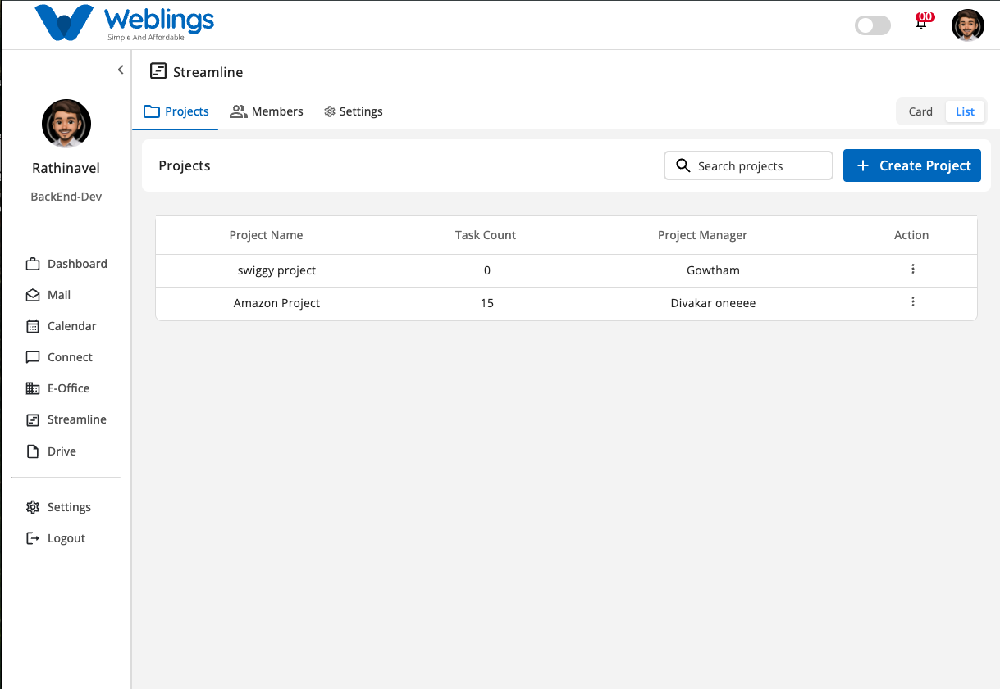

# Projects


The **Projects** module allows you to create, organize, and manage all projects within your organization. It provides both **Card View** and **List View**, making it easy to monitor project information, assign project managers, manage team members, and track project progress.

From this screen, you can:

- View projects in Card View or List View.
- Search for projects.
- Create a new project.
- Edit project details.
- Add or remove project members.
- Delete projects.
- Open the Project Details page.

---

# Project List & Card View

The Projects screen supports two viewing modes.

## Card View



Click the **Card View** icon in the top-right corner to display projects as cards.

Each project card displays:

- Project Name
- Task Count
- Project Manager
- Actions (Edit, Delete)

---

## List View



Click the **List View** icon to display projects in a table format.

The list includes:

- Project Name
- Task Count
- Project Manager
- Actions (Edit, Delete)

---

## Search Projects

Use the **Search** box to quickly find a project.

You can search using:

- Project Name
- Project Manager

Matching results are displayed automatically as you type.

---

# Edit a Project

To modify a project:

1. Click the **More Options (⋮)** icon.
2. Select **Edit**.

The Edit window contains two tabs:

- Project Details
- Members

---

# Project Details

The **Project Details** tab allows you to update project information.

You can modify:

- Project Profile Image
- Project Name
- Description
- Duration
- Project Manager

After making changes:

- Click **Save Changes** to update the project.
- Click **Discard Changes** to cancel all modifications.

---

# Members

The **Members** tab allows you to manage project members.

From this tab, you can:

- Add new members.
- Remove existing members.
- View all assigned members.

Changes take effect after saving.

---

# Delete a Project

To delete a project:

1. Click the **More Options (⋮)** icon.
2. Select **Delete**.

A confirmation dialog will appear.

## Confirmation Message

> **Delete Project?**
> 

This action will permanently remove the selected project from your organization.

If the project contains tasks, sprint data, or assigned members, ensure all required work has been completed or reassigned before deleting the project.

Choose one of the following options:

- **Delete** — Permanently removes the project.
- **Cancel** — Closes the confirmation window without deleting the project.

---

# Project Details Page

Click a project from either the **Card View** or **List View** to open the **Project Details** page.

The Project Details page contains the following tabs:

- Timeline
- Backlog
- Sprint
- Board
- Members
- Settings

---

# Workflow

```
Open Projects
        ↓
Choose Card View or List View
        ↓
Search Existing Projects (Optional)
        ↓
Click Add Project
        ↓
Enter Project Information
        ↓
Create Project
        ↓
Add Members Now or Later
        ↓
Project Created Successfully
        ↓
Open Project Details
        ↓
Manage Timeline, Backlog, Sprint, Board, Members, and Settings
```

---

# Quick Summary

The **Projects** module enables you to:

- View projects in Card View or List View.
- Search and manage projects.
- Create new projects.
- Assign Project Managers.
- Add or remove project members.
- Edit project details.
- Delete projects.
- Manage project timelines, backlogs, sprints, boards, members, and settings.

[Timeline](Streamline/Projects/Timeline%203b47b10881758019bc32c333cfd9c4f9.md)

[Backlog](Streamline/Projects/Backlog%203b47b108817580a4bfc4f70df8ff6db1.md)

[Sprint](Streamline/Projects/Sprint%203b47b108817580f7ad6edefc637c4936.md)

[Board](Streamline/Projects/Board%203b47b1088175802c8dd3c6adebadc339.md)

[Members](Streamline/Projects/Members%203b47b108817580dd800fe25aa9905a77.md)

[Settings](Streamline/Projects/Settings%203b47b108817580888e38cef78b46e105.md)