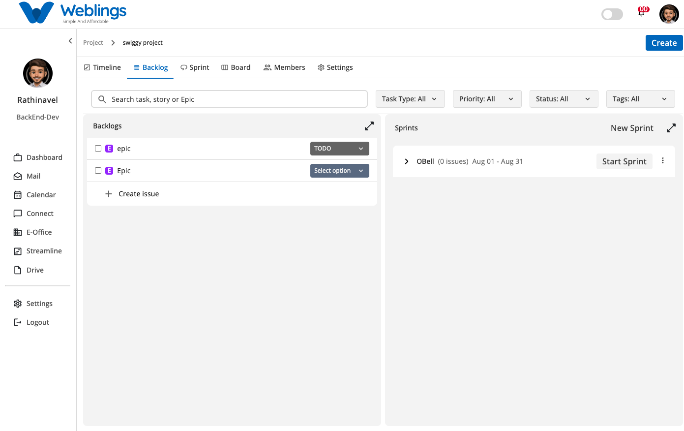
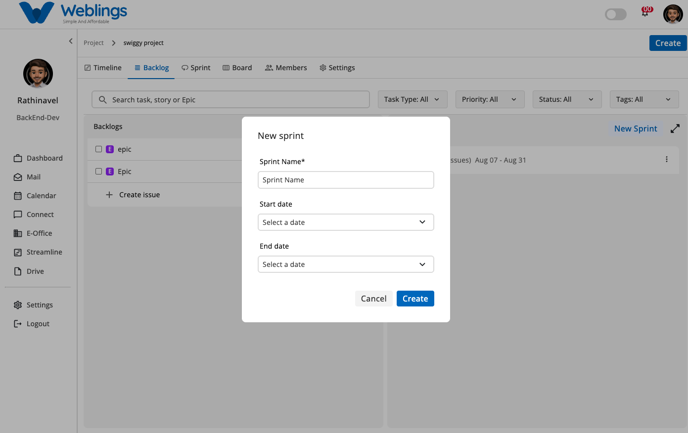
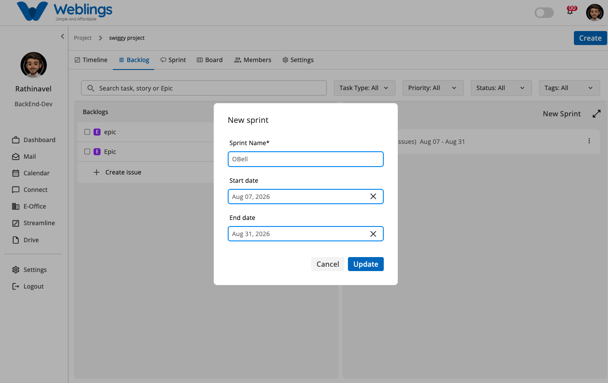
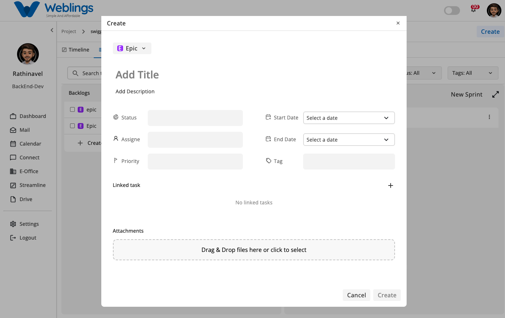

# Backlog

# Backlog & Sprint Management

The Backlog screen helps you organize, filter, and plan work items for your project. It split-screens your unassigned work (**Backlogs**) alongside your active and planned development cycles (**Sprints**). You can use this screen to prepare issues, group them into sprints, and manage sprint lifecycles.

The screen displays two main sections:

- **Backlogs Panel (Left):** Lists all unallocated work items, Epics, Stories, Tasks, and Sub-tasks waiting to be prioritized or assigned to a sprint.
- **Sprints Panel (Right):** Displays current, planned, or completed sprints with issue counts, date ranges, and execution controls.

---

## Managing Sprints & Assigning Work

### 1. Creating a New Sprint

1. Click the **New Sprint** button located at the top-right of the Sprints panel.
2. The **New sprint** modal will appear. Fill in the details:
    - **Sprint Name:** Enter a name for the sprint.
    - **Start Date:** Choose when the sprint begins.
    - **End Date:** Choose the target end date for the sprint cycle.
3. Click **Create** to add the sprint to the panel, or **Cancel** to close the window.

### 2. Assigning Backlog Items to a Sprint (Drag & Drop)

- You can easily allocate work to a sprint by using **drag and drop**. Simply click and hold any task or epic from the **Backlogs** list on the left, drag it over to the target sprint container in the **Sprints** panel on the right, and release it.

### 3. Starting a Sprint

- Once a sprint has been created and populated with issues, click **Start Sprint** on the sprint card header to kick off the development cycle.

### 4. Editing a Sprint

- Click the three-dot menu icon (`⋮`) next to **Start Sprint** on any sprint card and select **Edit** to modify the sprint's name or date range.

---

## Searching and Filtering Issues

At the top of the Backlog view, you can use the search bar and filter controls to narrow down items:

- **Search Bar:** Type keywords in `Search task, story or Epic` to instantly filter work items by title.
- **Task Type Filter:** Filter issues by specific types:
    - **Epic**
    - **Story**
    - **Task**
    - **Sub Task**
- **Priority Filter:** Filter issues based on priority levels:
    - **High**
    - **Medium**
    - **Low**
- **Status Filter:** Filter issues based on workflow states:
    - **TODO**
    - **Onprocess**
    - **Hold**
    - **Done**
- **Tags Filter:** Search existing tags (such as `Frontend` or `Backend`) or create a new custom tag using the `+` button.

---

## Creating an Issue

To create a new task or epic:

1. Click the **Create** button at the top-right corner of the top header bar (or click **+ Create issue** at the bottom of the Backlog list).
2. The **Create** modal will open. Fill in the following details:
    - **Issue Type Dropdown:** Choose between *Epic*, *Story*, *Task*, or *Sub Task*.
    - **Add Title:** Enter a clear title for the work item.
    - **Add Description:** Add detailed notes or instructions.
    - **Status:** Select the initial state (e.g., *TODO*).
    - **Assignee:** Choose the team member responsible.
    - **Priority:** Set urgency level (e.g., *Medium*).
    - **Start Date & End Date:** Pick schedule boundaries using calendar selectors.
    - **Tag:** Assign existing tags (e.g., `Frontend`, `Api`).
    - **Linked Task:** Connect related tasks or dependencies by clicking `+`.
    - **Attachments:** Drag & drop files or click to upload relevant documents or screenshots.
3. Click **Create** to save the issue, or click **Cancel** to discard.

---

[FAQ](Streamline/Projects/Backlog/FAQ%203b57b1088175807b9f6ae9101344f6f4.md)