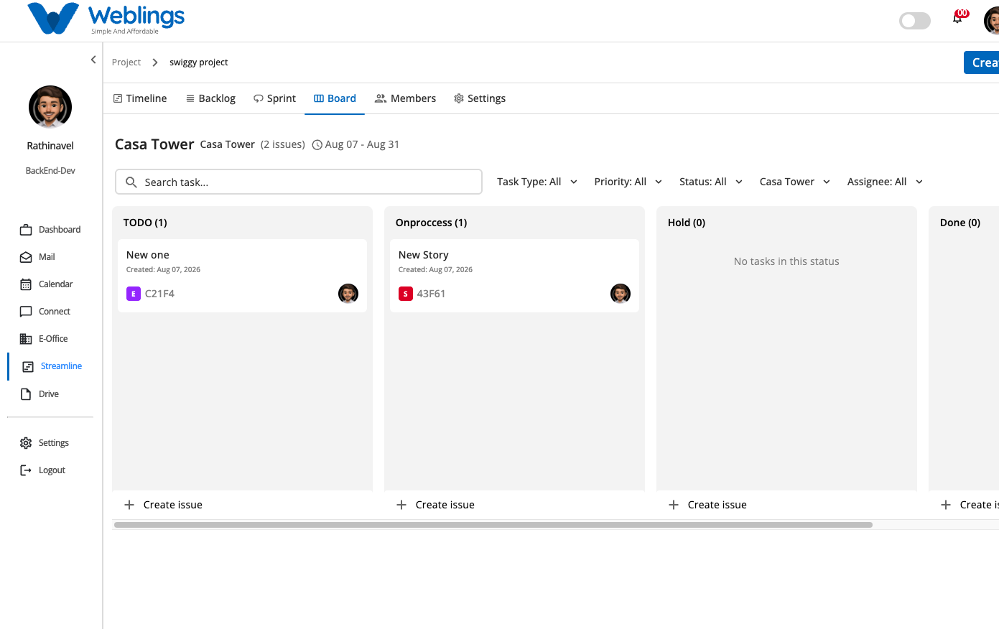
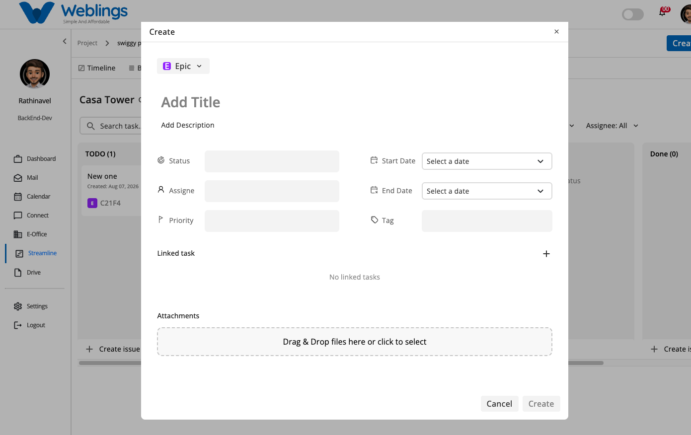

# Board

# Board Management

The Board screen provides a visual Kanban-style board to track and manage tasks within your active sprint. It categorizes work items into distinct status columns, allowing team members to monitor progress, update task statuses dynamically, and manage workflow execution.

The screen displays your active sprint board with the following information:

- **Sprint Information Header:** Displays the active sprint name, total issue count, and schedule duration (e.g., *Casa Tower (2 issues) Aug 07 - Aug 31*).
- **Status Columns:** Organizes tasks across key workflow states:
    - **TODO:** Tasks waiting to be started.
    - **Onprocess:** Tasks currently being worked on.
    - **Hold:** Tasks temporarily paused or blocked.
    - **Done:** Completed tasks.
- **Task Cards:** Displays item titles, creation dates, unique issue keys, issue type badges, and assigned team member avatars.

---

## Searching and Filtering Board Tasks

At the top of the Board view, you can filter and search for tasks in real time:

- **Search Bar:** Type keywords in `Search task...` to instantly locate tasks by title or key.
- **Task Type Filter:** Filter board cards by issue category (*Epic*, *Story*, *Task*, *Sub Task*).
- **Priority Filter:** Filter tasks by urgency level (*High*, *Medium*, *Low*).
- **Status Filter:** Display tasks belonging to specific workflow columns (*TODO*, *Onprocess*, *Hold*, *Done*).
- **Sprint Name Filter:** Toggle between active or planned sprints (e.g., *Casa Tower*).
- **Assignee Filter:** View tasks assigned to specific team members or filter by unassigned items.

---

## Updating Task Status (Drag & Drop)

You can update a task's progress status directly on the board:

1. Click and hold a task card in any status column (e.g., *TODO*).
2. Drag the card horizontally into your target status column (e.g., *Onprocess* or *Done*).
3. Drop the card into the column. The task status updates automatically across the system.

---

## Creating an Issue from the Board

To create a new task directly from the Board screen:

1. Click the **Create** button in the top-right navigation header, or click **+ Create issue** at the bottom of any status column.
2. The **Create** modal will open. Fill in the required details:
    - **Issue Type:** Select *Epic*, *Story*, *Task*, or *Sub Task*.
    - **Add Title:** Enter a descriptive task title.
    - **Add Description:** Add detailed notes or task instructions.
    - **Status:** Set the workflow column state.
    - **Assignee:** Select the team member responsible.
    - **Priority:** Set the urgency level.
    - **Start Date & End Date:** Choose schedule boundaries using calendar pickers.
    - **Tag:** Assign relevant tags (e.g., *Frontend*, *Backend*).
    - **Linked Task:** Connect dependencies by clicking `+`.
    - **Attachments:** Upload files via drag-and-drop or file selector.
3. Click **Create** to save and place the card on the board, or click **Cancel** to discard.

---

[FAQ](Streamline/Projects/Board/FAQ%203b57b10881758061b262fd7383a6aa09.md)