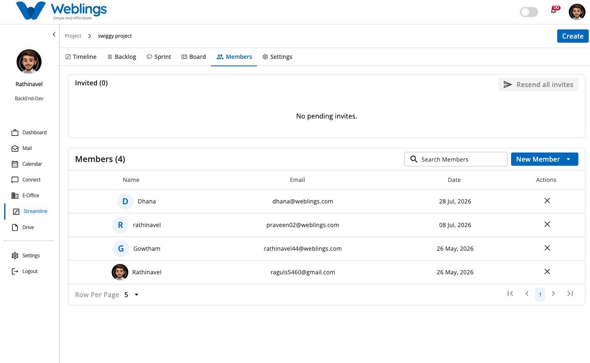
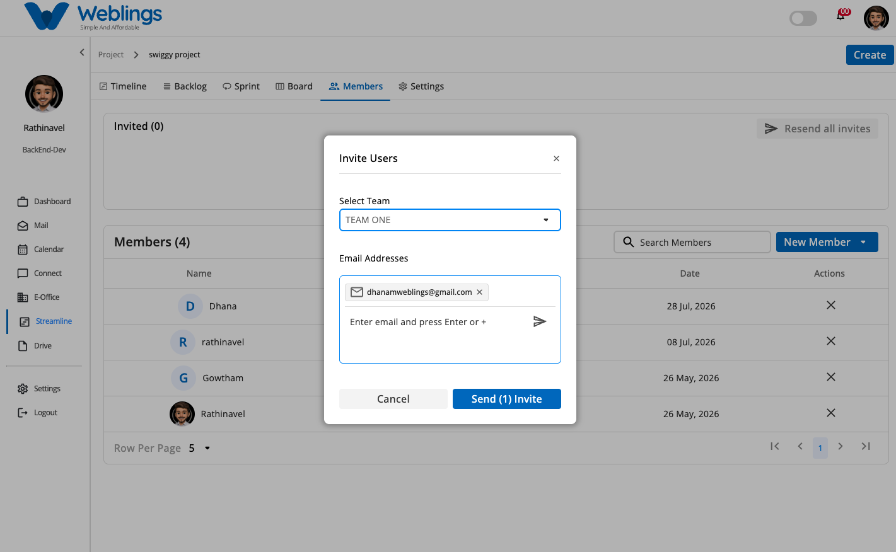
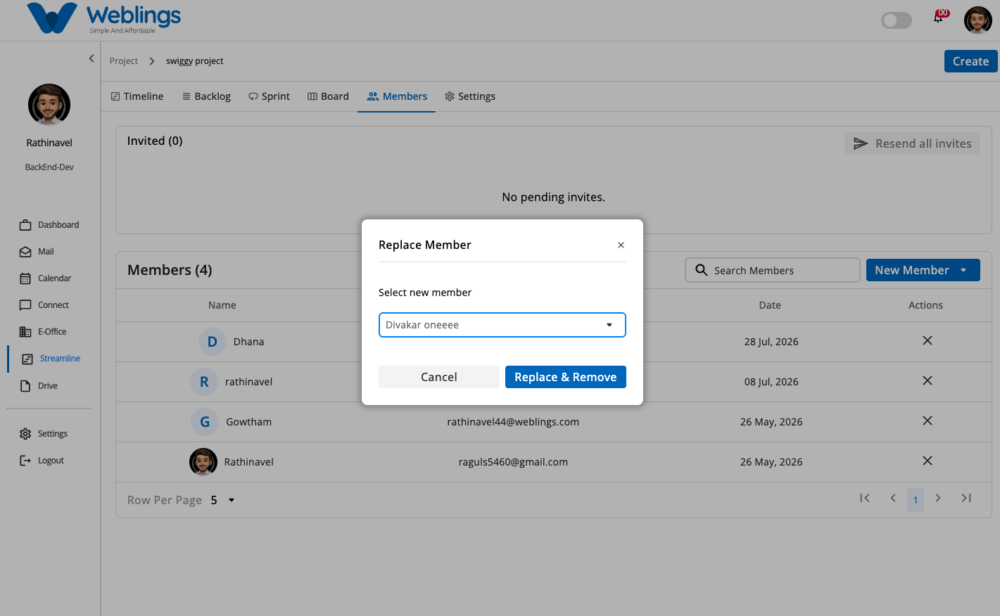

# Members

# Member Management

The Members screen helps you manage team access and organization within your project. You can view existing project members, track pending email invitations, add existing users to teams, send new email invitations, and safely remove or replace members.

The screen displays two main sections:

- **Invited Panel (Top):** Displays a list of pending user invitations. Includes a **Resend all invites** button to resend pending invitation emails.
- **Members Table (Bottom):** Displays active project members with the following details:
    - **Name** (Member avatar and full name)
    - **Email** (Associated email address)
    - **Date** (Date the member joined or was added)
    - **Actions** (Remove/Replace icon `✕`)

You can also use the **Search Members** bar to quickly find active members by name or email, and adjust pagination using **Row Per Page**.

---

## Adding an Existing Member

To add a user who is already registered on the platform to your project team:

1. Click the **New Member** dropdown button at the top-right of the Members table.
2. Select **Add Member**.
3. The **Add Member** modal will open:
    - **Select Member:** Choose the user from the dropdown list.
    - **Select Team:** Choose the team to assign the member to.
4. After completing both fields, click **Add Member**.
5. The user will be added directly to the active Members table.
6. If you do not wish to proceed, click **Cancel** to close the modal.

---

## Inviting a New User

To invite a new user who is not yet part of the project:

1. Click the **New Member** dropdown button at the top-right of the Members table.
2. Select **Invite User**.
3. The **Invite Users** modal will open:
    - **Select Team:** Choose the team for the new user (e.g., *TEAM ONE*).
    - **Email Addresses:** Enter the user's email address and press `Enter` or click the paper plane button `➤` to add it. You can enter multiple email addresses.
4. Click **Send Invites** (e.g., *Send (1) Invite*).
5. Before the user accepts, their email will appear in the **Invited** panel at the top.
6. The invited user will receive an invitation email. Once they accept the invite, they will automatically move from the Invited list into the active **Members** table.

---

## Removing or Replacing a Member

To remove a team member from the project:

1. Click the remove action button (`✕`) in the **Actions** column next to the member's name.
2. The **Replace Member** modal will open:
    - **Select new member:** Choose an existing team member from the dropdown to inherit or take over the removed member's active tasks and responsibilities.
3. Click **Replace & Remove** to finalize the removal.
4. If you do not wish to remove the member, click **Cancel**.

---

[FAQ](Streamline/Projects/Members/FAQ%203b57b108817580ad84f2d53ab8e0b239.md)