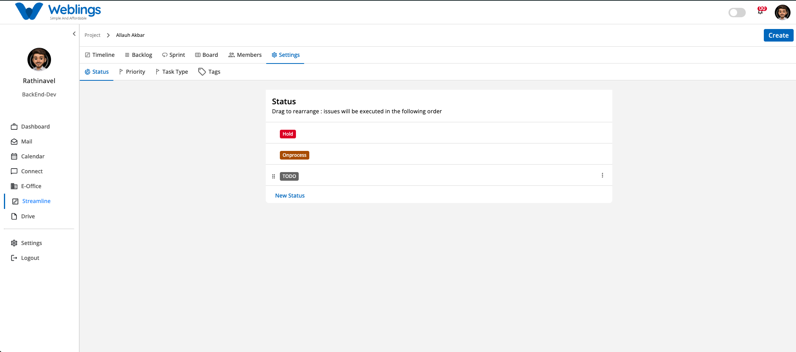
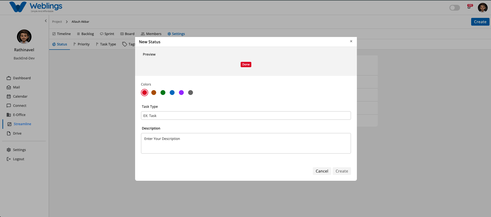
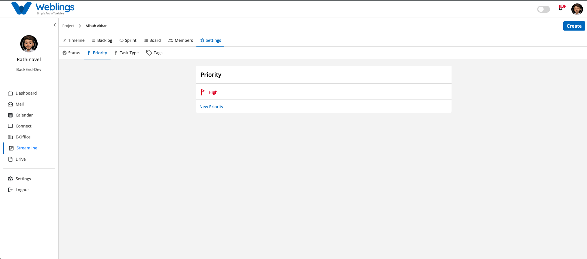
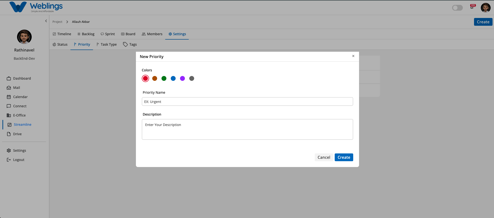
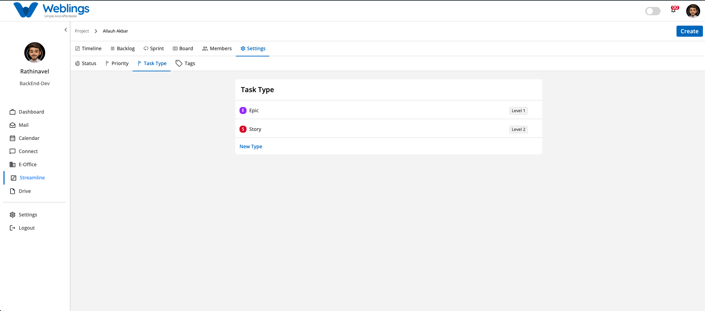
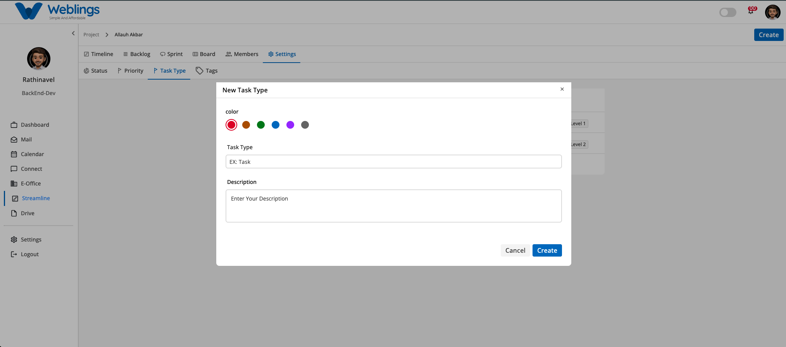
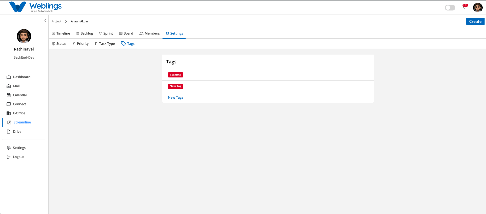
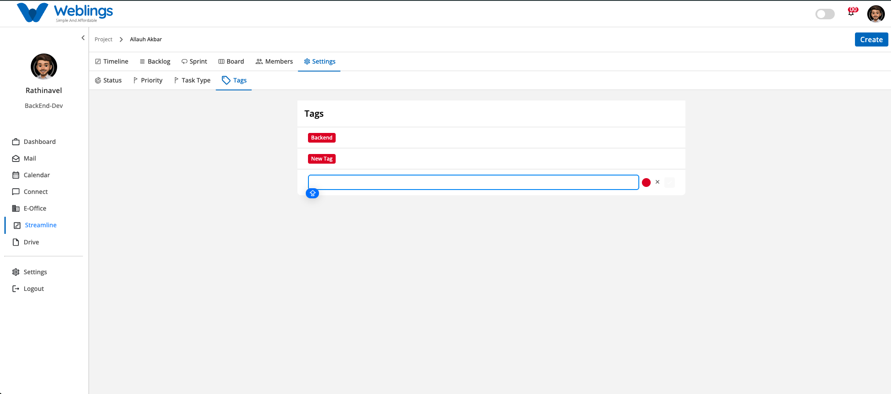

# Settings

# Project Settings

The Project Settings screen allows project administrators to configure and customize core workflow elements for their project. You can manage workflow statuses, priority levels, task types, and custom organizational tags across four dedicated tabs: **Status**, **Priority**, **Task Type**, and **Tags**.

---

## 1. Status Management

The **Status** tab lets you define and sequence the lifecycle stages of your project issues (e.g., *TODO*, I*n Process*, *Hold*, *Done*). Issues will be executed and displayed on the Board according to the reordered position configured here.

### Adding a New Status

1. Navigate to **Settings > Status**.
2. Click **New Status** at the bottom of the list.
3. The **New Status** modal will open with the following fields:
    - **Preview:** Visual badge preview showing how the status tag will look.
    - **Colors:** Select a color palette dot (e.g., Red, Green, Blue, Purple, Grey) for the badge background.
    - **Task Type:** Enter a name for the status (e.g., *In Review*).
    - **Description:** Enter optional details explaining when an issue enters this status.
4. Click **Create** to save the new status, or **Cancel** to discard.

### Reordering Statuses (Drag & Drop)

- You can change the display order of statuses on your board by dragging and dropping.
- Hover over any status row to reveal the six-dot handle (`::`) on the left side.
- Click and drag the status item vertically up or down to set its new position in the workflow sequence.

---

## 2. Priority Management

The **Priority** tab allows you to configure urgency levels used across tasks and stories (e.g., *High*, *Medium*, *Low*).

### Adding a New Priority

1. Navigate to **Settings > Priority**.
2. Click **New Priority** at the bottom of the list.
3. The **New Priority** modal will open with the following fields:
    - **Colors:** Select a color icon dot for the flag indicator.
    - **Priority Name:** Enter the title for the priority level (e.g., *Urgent* or *Critical*).
    - **Description:** Enter optional details clarifying when to apply this priority level.
4. Click **Create** to save the new priority, or **Cancel** to discard.

> **Note:** Priority items are fixed in order and cannot be rearranged via drag and drop.
> 

---

## 3. Task Type Management

The **Task Type** tab defines the structural hierarchy and categories of work items in your project (e.g., *Epic*, *Story*, *Task*, *Sub Task*).

### Adding a New Task Type

1. Navigate to **Settings > Task Type**.
2. Click **New Type** at the bottom of the list.
3. The **New Task Type** modal will open with the following fields:
    - **color:** Select a color badge for the type icon.
    - **Task Type:** Enter the name for the issue type (e.g., *Bug* or *Milestone*).
    - **Description:** Enter optional details describing this work item type.
4. Click **Create** to save the new task type, or **Cancel** to discard.

> **Note:** Task Types follow an established system hierarchy (Level 1, Level 2, etc.) and cannot be rearranged using drag and drop.
> 

---

## 4. Tags Management

The **Tags** tab allows you to create custom metadata labels used to categorize issues across frontend, backend, API, or custom components.

### Adding a New Tag

1. Navigate to **Settings > Tags**.
2. Click **New Tags** at the bottom of the list.
3. An inline creation box will appear:
    - **Tag Name Input:** Type the name of the new tag (e.g., *Database* or *UI/UX*).
    - **Color Circle:** Click the red circle icon to select a custom color for the tag.
4. Click the checkmark (`✓`) button to save the tag.
5. Click the cancel button (`✕`) if you wish to discard the tag.

> **Note:** Tags cannot be rearranged via drag and drop.
> 

---

## 5. Editing or Deleting Settings Items

You can modify or delete existing items across any of the settings tabs (**Status**, **Priority**, **Task Type**, or **Tags**):

1. Hover your cursor over any row item inside a settings tab.
2. A three-dot vertical menu icon (`⋮`) will appear on the right side of the item container.
3. Click the three-dot icon (`⋮`) to reveal the action menu options:
    - **Edit:** Opens the item details modal to let you change its name, color, or description. Click **Update** to save changes.
    - **Delete:** Permanently removes the item from the project settings.

---

[FAQ](Streamline/Projects/Settings/FAQ%203b87b108817580c6a918c92405e1b17d.md)