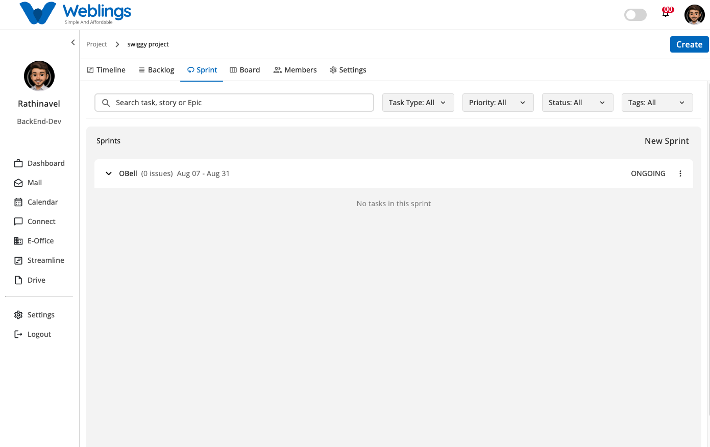
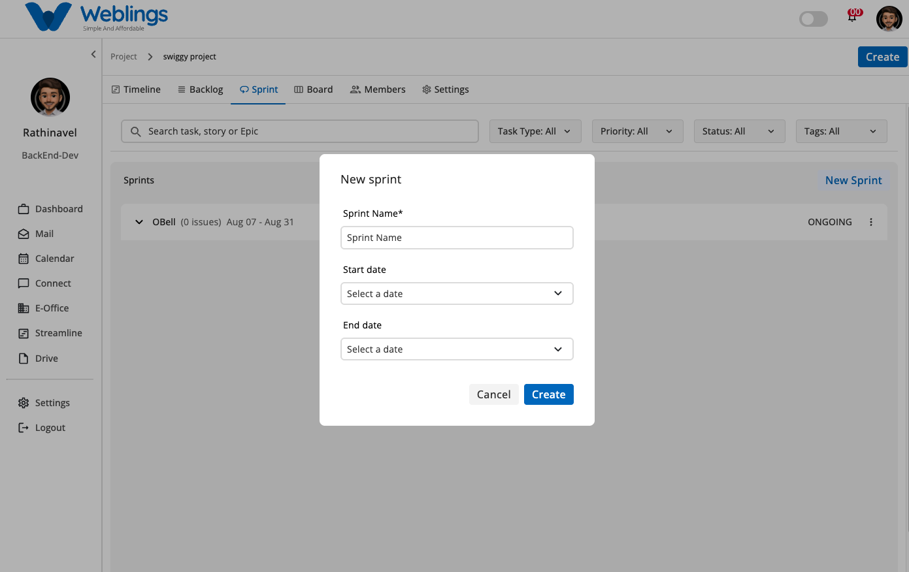
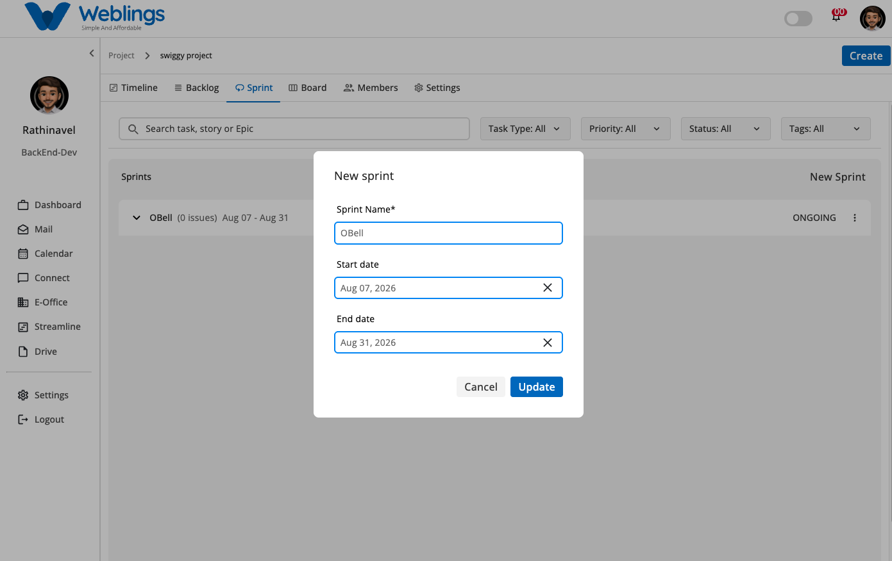

# Sprint

# Sprint Management

The Sprint Management screen helps you plan, track, and manage your active and upcoming development iterations (sprints). You can create new sprints, configure start and end dates, update existing sprint details, and filter nested tasks within active iterations.

The screen displays your list of sprints with the following information:

- **Sprint Title** (Name of the sprint iteration)
- **Issue Count** (Total number of active issues linked to the sprint)
- **Date Duration** (Configured Start Date and End Date range)
- **Sprint Status** (Current state indicator, e.g., *ONGOING*)
- **Action Menu** (Three-dot options menu `⋮` for edit operations)

You can also use the top filtering bar to quickly locate specific tasks, stories, or epics assigned across your sprints.

---

## Searching and Filtering Sprint Issues

At the top of the Sprint view, you can filter and search for items contained within your sprints:

- **Search Bar:** Type keywords in `Search task, story or Epic` to search work items by title.
- **Task Type Filter:** Filter tasks inside sprints by type (*Epic*, *Story*, *Task*, *Sub Task*).
- **Priority Filter:** Filter sprint issues by urgency level (*High*, *Medium*, *Low*).
- **Status Filter:** Filter issues by workflow state (*TODO*, *Onprocess*, *Hold*, *Done*).
- **Tags Filter:** Filter items by assigned functional tags (e.g., *Frontend*, *Backend*).

---

## Create a New Sprint

To create a new sprint:

1. Click the **New Sprint** button located at the top-right corner of the Sprints panel.
2. The **New sprint** modal will open. Fill in the following details:
    - **Sprint Name:** Enter a unique name for the iteration (e.g., *OBell*).
    - **Start Date:** Select the launch date using the calendar picker (e.g., *Aug 07, 2026*).
    - **End Date:** Select the planned completion date using the calendar picker (e.g., *Aug 31, 2026*).
3. Click **Create** to save and add the new sprint to your project list.
4. If you do not want to create the sprint, click **Cancel** to return without saving.

---

## Edit a Sprint

If you need to update an existing sprint's schedule or title:

1. Click the three-dot menu icon (`⋮`) on the right side of the sprint card.
2. Select **Edit** from the dropdown menu.
3. The **New sprint** modal will open populated with existing details:
    - Modify the **Sprint Name**.
    - Adjust the **Start date** or **End date** by clearing existing dates (`✕`) and selecting new dates.
4. Click **Update** to save your changes immediately.
5. If you do not want to save the modifications, click **Cancel** to discard changes.

---

[FAQ](Streamline/Projects/Sprint/FAQ%203b57b10881758055b2cce9c5fd91cbc9.md)