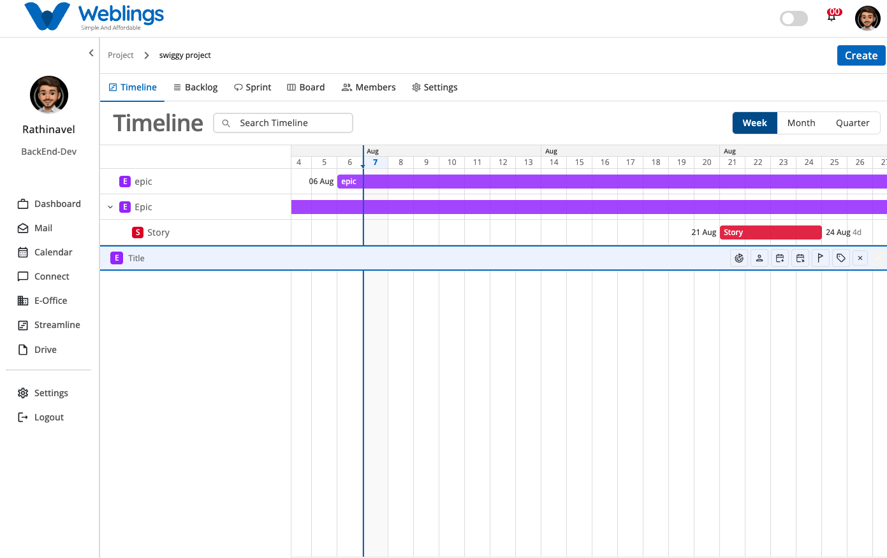
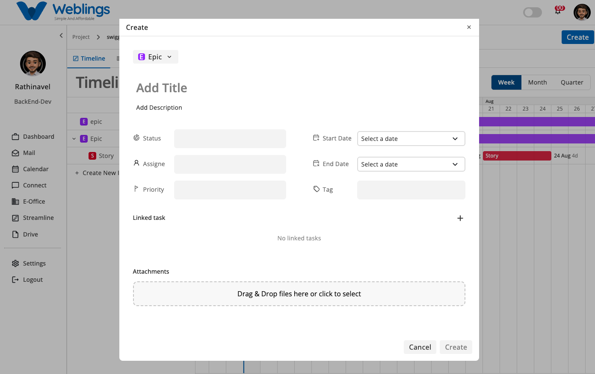
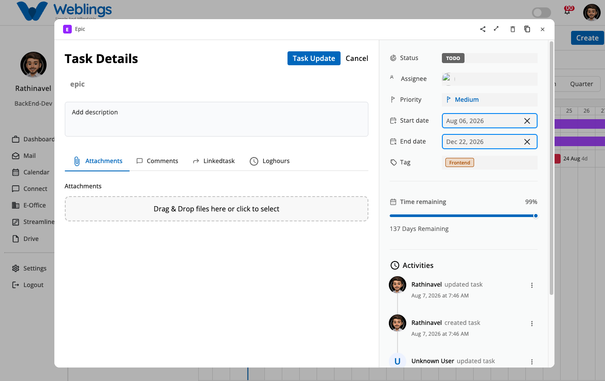

# Timeline

# Timeline Management

The Timeline screen helps you visualize, track, and manage your overall project schedule. It provides a roadmap view of your project's progress across various timeframes. You can monitor start and end dates, track active tasks, and check project milestones relative to today's date.

The screen displays your project timeline with the following view options and information:

- **Weekly View** (Tracks short-term schedules week by week)
- **Monthly View** (Tracks medium-term goals month by month)
- **Quarterly View** (Tracks long-term planning across project quarters)
- **Today Line Indicator** (A vertical blue line representing the current date)
- **Start Time & End Time** (Visual calendar duration for each task or epic)

You can also use the **Search Timeline** bar to quickly locate a specific task or epic by name.

---

## Create a New Task or Epic

To create a new item, click the **Create** button located at the top-right corner of the screen.

The creation modal will open.

### Step 1: Fill Item Information

Fill in the following details:

- **Status**
Select the current progress state (e.g., *To Do*, *In Progress*, *Completed*).
- **Start Date & End Date**
Choose the starting date and deadline for the item. *Example:* Start Date: May 1 | End Date: June 15
- **Assignee**
Select the team member responsible for working on the item.
- **Priority**
Set the priority level (e.g., *Low*, *Medium*, *High*, *Urgent*).
- **Tag**
Add relevant categories or labels to filter and organize tasks.
- **Linked Task**
Connect related dependencies or dependent tasks.
- **Attachment**
Upload relevant reference documents, images, or files.

### Step 2: Save or Discard Item

After entering all necessary details:

- Click **Task Update** or **Create** to save and add the new **Task**, **Epic**, **Story**, or work item to the project timeline.
- Click **Cancel** to discard your inputs and return to the timeline view without saving.

---

## View and Edit Item Details

When you click on any issue type (such as an Epic, Task, or Story) on the Timeline. the **Task Details** modal opens. This view allows you to review, edit, or delete the item's information.

### 1. Information Displayed in the View Modal

#### **Main Workspace (Left Side)**

- **Issue Type & Title:** Displays the issue badge (e.g., *Epic*) and title at the top header.
- **Title/Name Field:** Shows the item name (e.g., *Epic*).
- **Description Box:** Displays detailed information or instructions regarding the item (*Add description*).
- **Tabbed Section:**
    - **Attachments:** Upload or review attached files via drag-and-drop or file selection.
    - **Comments:** View team feedback or post updates on the issue.
    - **Linkedtask:** Review related dependencies or connected tasks.
    - **Loghours:** Track time spent working on the item.

#### **Metadata Panel (Right Side)**

- **Status:** Current progress status (e.g., *NO STATUS*, *In Progress*, *Done*).
- **Assignee:** Team member currently assigned to the item (*Add Assignee*).
- **Priority:** Current priority setting (*Select Priority*).
- **Start Date:** Scheduled start date calendar selector.
- **End Date:** Scheduled completion date calendar selector.
- **Tag:** Assigned tags or category labels (*Select Tag*).
- **Activities:** Complete historical audit log showing updates made, timestamps, and who performed them (e.g., *Rathinavel updated task*, *Rathinavel created task*).
- **Created By:** Displays the original author and creation timestamp.

---

### 2. Editing Item Details

You can modify any of the details directly within this modal:

1. Update the **Title**, **Description**, **Status**, **Assignee**, **Priority**, **Start Date**, **End Date**, or **Tags**.
2. Add or remove **Attachments**, add new **Comments**, manage **Linkedtasks**, or adjust **Loghours**.
3. Click the **Task Update** button at the top to save your changes immediately.
4. If you do not wish to keep your changes, click **Cancel** to close the modal without saving.

---

### 3. Deleting an Item

If an item is no longer required:

1. Click the **Delete (🗑️)** icon located in the top-right header tools of the modal.
2. A confirmation prompt will appear asking you to confirm the action.
3. Select **Delete** on the confirmation dialog to permanently remove the item from the project timeline, or select **Cancel** to keep it.

---

## Organizing Work Items (Hierarchy)

Once work items are created, you can build a clear project structure:

- **Create inside an Epic:** Click on an existing Epic to create nested **Stories**, **Tasks**, or **Subtasks** inside it.
- **Create a new Epic:** Click the **Create** button at any time to add a brand new top-level **Epic**.

---

[FAQ](Streamline/Projects/Timeline/FAQ%203b57b1088175802889cad2561986b554.md)