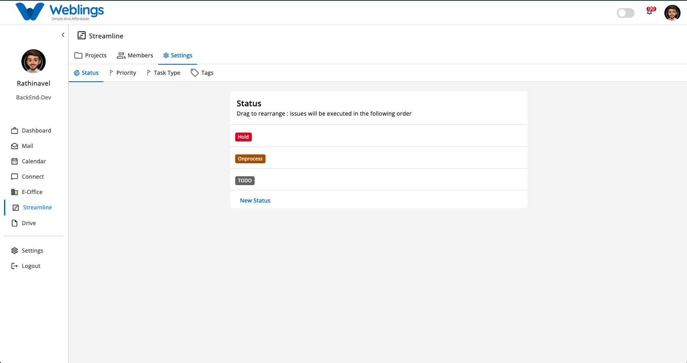
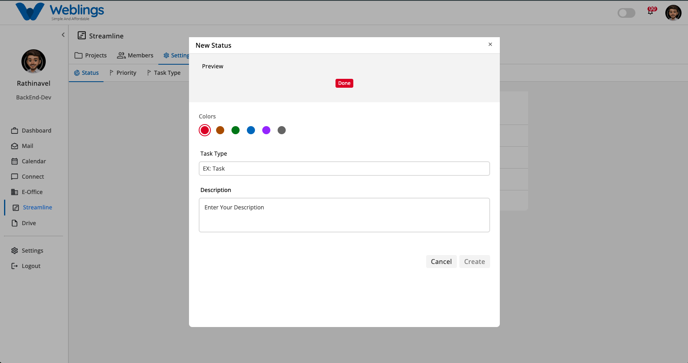
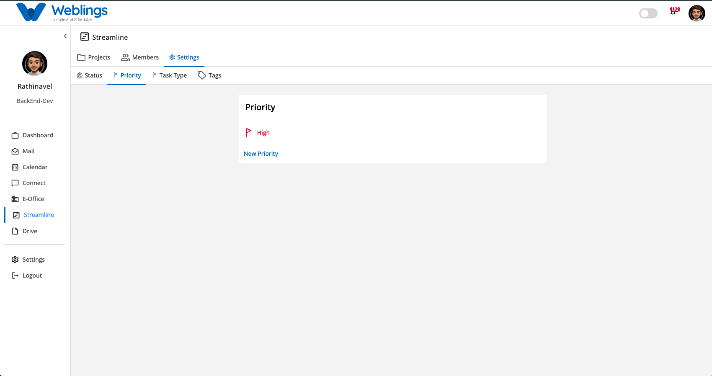
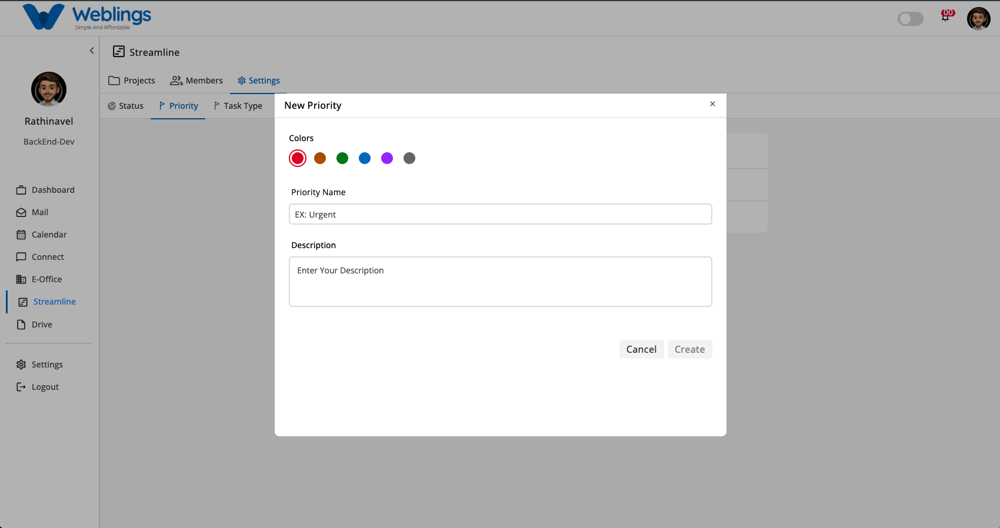
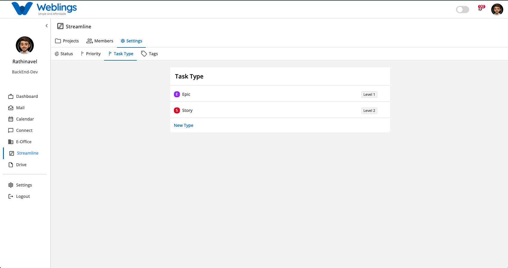
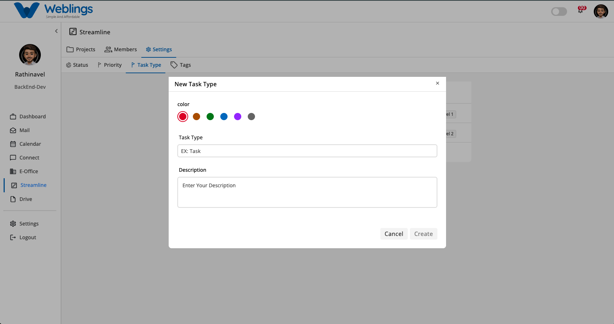
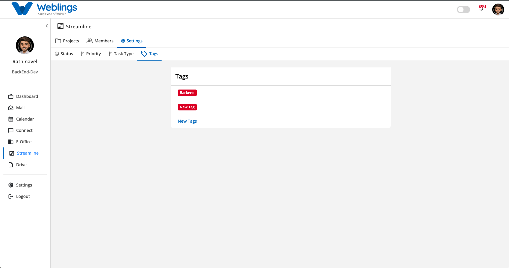
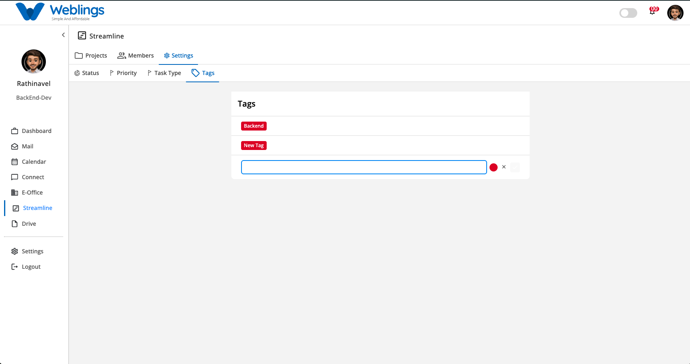

# Settings

The Settings page under Streamline allows administrators to define and manage global configuration settings across all organization projects. You can manage workflow execution stages, urgency priorities, issue hierarchies, and metadata tags across four main tabs: **Status**, **Priority**, **Task Type**, and **Tags**.

---

## 1. Status Settings

The **Status** tab allows you to configure workflow execution stages (e.g., *Hold*, *Onprocess*, *TODO*).

### Creating a New Status

1. Navigate to **Streamline > Settings > Status**.
2. Click **New Status** at the bottom of the list.
3. The **New Status** modal will open:
    - **Preview:** Displays a real-time badge preview of the status color and name.
    - **Colors:** Choose a badge color dot (Red, Orange, Green, Blue, Purple, or Grey).
    - **Task Type:** Enter the title for the new status.
    - **Description:** Enter optional notes explaining the status stage.
4. Click **Create** to save the new status, or click **Cancel** to discard.

### Managing Statuses (Edit & Delete)

- **Reordering:** Drag and drop status items vertically to set the sequence order in which issues will be executed on project boards.
- **Editing:** Hover over any status item, click the three-dot action icon (`⋮`), and select **Edit**. The edit modal will open pre-populated. Modify any field and click **Update** (or **Cancel** to exit without saving).
- **Deleting:** Hover over any status item, click the three-dot action icon (`⋮`), and select **Delete**. A confirmation prompt will appear (*"Delete Status? Deleting this status cannot be undone!"*). Click **Delete** to confirm or **Cancel** to keep the status.

---

## 2. Priority Settings

The **Priority** tab configures the urgency flags used across tasks and issues (e.g., *High*, *Medium*, *Low*).

### Creating a New Priority

1. Navigate to **Streamline > Settings > Priority**.
2. Click **New Priority** at the bottom of the list.
3. The **New Priority** modal will open:
    - **Colors:** Select a color dot for the flag indicator.
    - **Priority Name:** Enter the priority label (e.g., *High* or *EX: Urgent*).
    - **Description:** Add optional details describing when to apply this priority level.
4. Click **Create** to save, or **Cancel** to discard.

### Managing Priorities (Edit & Delete)

- **Editing:** Hover over a priority row, click the three-dot action icon (`⋮`), and select **Edit**. Modify the color, name, or description in the modal and click **Update** (or **Cancel** to discard changes).
- **Deleting:** Hover over a priority row, click the three-dot action icon (`⋮`), and select **Delete**. A confirmation prompt will appear (*"Delete Priority? Deleting this priority cannot be undone!"*). Click **Delete** to confirm or **Cancel** to cancel the operation.

---

## 3. Task Type Settings

The **Task Type** tab manages issue classifications and level hierarchies across your projects (e.g., *Epic* - Level 1, *Story* - Level 2, *Task* - Level 3).

### Creating a New Task Type

1. Navigate to **Streamline > Settings > Task Type**.
2. Click **New Type** at the bottom of the list.
3. The **New Task Type** modal will open:
    - **color:** Choose a color dot for the issue badge icon.
    - **Task Type:** Enter the task type name.
    - **Description:** Add optional notes describing the issue type.
4. Click **Create** to save, or **Cancel** to discard.

---

## 4. Tags Settings

The **Tags** tab allows you to create and manage custom organization-wide labels used to classify work items (e.g., *Backend*, *Frontend*, *API*).

### Creating a New Tag (Inline Creation)

1. Navigate to **Streamline > Settings > Tags**.
2. Click **New Tags** at the bottom of the list.
3. An inline creation box will appear directly inside the list container:
    - **Tag Name Box:** Type the name of your new tag (e.g., *Backend*, *New Tag*).
    - **Color Circle:** Click the color circle (defaulted to red) to choose a color for the tag badge.
4. Click the checkmark button (`✓`) to save and add the new tag to the list.
5. Click the cancel button (`✕`) if you want to cancel and close the inline input without saving.

### Managing Tags (Edit & Delete)

- **Editing:** Hover over any tag row, click the three-dot action icon (`⋮`), and select **Edit**. Update the tag name or badge color and save.
- **Deleting:** Hover over any tag row, click the three-dot action icon (`⋮`), and select **Delete**. A confirmation prompt will ask you to confirm tag removal.

---

[ FAQ](Settings/FAQ%203b87b108817580b5a729d82c140d4fa6.md)